# ThreatLens — A Full-Stack Cyber Threat Intelligence Platform for Real-Time IOC Analysis

## GTU 8th Semester Internship Report

---

| Field | Details |
|---|---|
| **Student Name** | Prince Girishbhai Prajapati |
| **Enrollment Number** | 220390107024 |
| **College** | Saffrony Institute of Technology, Mehsana |
| **Department** | Computer Engineering |
| **Degree** | Bachelor of Engineering in Computer Engineering |
| **GTU Semester** | 8th Semester |
| **Academic Year** | 2022–2026 |
| **Internal Guide** | Kunal Singh Kathia |
| **Company** | ForensicCyberTech |
| **Company Mentor** | Mayank Rajput |
| **Internship Period** | 1st January 2026 to 28th February 2026 (8 Weeks) |
| **Project Title** | ThreatLens — A Full-Stack Cyber Threat Intelligence Platform for Real-Time IOC Analysis |

---

## ACKNOWLEDGEMENT

The successful completion of this internship project would not have been possible without the guidance, support, and encouragement of several individuals and institutions, to whom the author extends sincere gratitude and heartfelt appreciation.

First and foremost, the author would like to express profound gratitude to **Gujarat Technological University (GTU)** for structuring the 8th Semester Internship Program as an integral part of the Bachelor of Engineering curriculum. This programme provided the invaluable opportunity to bridge the gap between academic theory and real-world industry practice, enabling the practical application of knowledge acquired throughout the four-year undergraduate journey. The foresight of GTU in mandating industry-based internship training has been instrumental in shaping the professional competencies of the author.

The author is deeply thankful to **Saffrony Institute of Technology, Mehsana**, and its esteemed faculty of the Computer Engineering Department for providing a strong academic foundation. The rigorous coursework in data structures, database management systems, computer networks, web development, and information security formed the bedrock upon which this internship project was built. Special thanks are due to the Head of the Department and all faculty members who supported the internship process with timely documentation and academic guidance.

The author wishes to convey sincere appreciation to the internal guide, **Prof. Kunal Singh Kathia**, whose consistent mentorship, constructive feedback, and academic supervision ensured that the project met the rigorous standards expected at the university level. His periodic reviews and willingness to discuss technical challenges were invaluable throughout the duration of the internship.

Immense gratitude is extended to **ForensicCyberTech** for offering the opportunity to work on a production-grade cybersecurity project in a professional environment. The company's commitment to fostering talent and providing hands-on experience in cyber threat intelligence was pivotal to the success of this internship. The author is especially grateful to the company mentor, **Mr. Mayank Rajput**, whose technical expertise, patient guidance, and industry insights were a constant source of learning and inspiration. His mentorship in API integration, secure coding practices, and threat intelligence methodologies profoundly shaped the outcome of this project.

Finally, the author extends heartfelt thanks to family members and fellow colleagues for their unwavering moral support and encouragement throughout the internship period. Their patience and understanding during long working hours and challenging phases of development are deeply appreciated.

---

## ABSTRACT

*The contemporary cybersecurity landscape is characterised by an ever-expanding threat surface, with threat actors deploying increasingly sophisticated attack vectors including advanced persistent threats, polymorphic malware, phishing campaigns, and zero-day exploits at an unprecedented scale. Security Operations Centre (SOC) analysts and independent threat researchers face the daunting challenge of investigating hundreds of Indicators of Compromise (IOCs) daily — including suspicious IP addresses, domain names, URLs, and file hashes — using a fragmented ecosystem of open-source and commercial threat intelligence tools. The manual process of querying multiple intelligence sources, correlating responses, and synthesising unified verdicts is time-consuming, error-prone, and fundamentally unscalable in environments where timely threat detection is paramount.*

*This internship report presents ThreatLens, a full-stack, production-grade Cyber Threat Intelligence (CTI) platform developed during an 8-week internship at ForensicCyberTech under the mentorship of Mr. Mayank Rajput. ThreatLens addresses the critical problem of intelligence fragmentation by aggregating, normalising, and correlating threat data from six major intelligence sources — VirusTotal, GreyNoise, ThreatFox, URLhaus, MalwareBazaar, and IP Quality Score (IPQS) — into a single, unified analysis interface. The platform enables analysts to submit any IOC type (IPv4/IPv6 addresses, domains, URLs, MD5/SHA1/SHA256 file hashes) and receive an instant, multi-source verdict with an automated risk score computed using a weighted algorithm that considers detection ratios, abuse confidence percentages, threat classifications, and community reputation data.*

*The platform was built using a modern technology stack comprising Next.js 15 with the App Router architecture, React 18, TypeScript for type-safe development, MongoDB Atlas for persistent storage with Mongoose ODM, Tailwind CSS for utility-first responsive styling, Recharts and ECharts for interactive data visualisation, and Framer Motion for fluid UI animations. The backend leverages Next.js API Routes with a modular service-oriented architecture featuring dedicated client modules for each intelligence source, response normaliser layers, and a multi-source orchestrator that executes parallel API calls using Promise.allSettled() for fault-tolerant data aggregation. Authentication is implemented via JSON Web Tokens (JWT) with bcrypt password hashing, and input validation is enforced through Zod schema definitions.*

*Key features implemented include: (1) an automated IOC type detection engine using regular expression pattern matching; (2) a real-time security dashboard with 10+ interactive chart types displaying threat distribution, geolocation data, and temporal trends; (3) a comprehensive search history module with pagination, filtering, and CSV/JSON export functionality; (4) a file hash analysis module with MITRE ATT&CK framework mapping and sandbox analysis integration; (5) a domain intelligence side panel providing WHOIS, DNS, and SSL certificate data; and (6) a TTL-based MongoDB caching layer that reduces redundant API calls by approximately 65%.*

*The outcome is a production-deployed platform capable of analysing 100+ IOCs per session with an average response time of 8–12 seconds for full multi-source analysis, demonstrating that unified threat intelligence aggregation can be achieved cost-effectively using open-source technologies and free-tier API access.*

---

## LIST OF ABBREVIATIONS

| Abbreviation | Full Form |
|---|---|
| IOC | Indicator of Compromise |
| CTI | Cyber Threat Intelligence |
| API | Application Programming Interface |
| URL | Uniform Resource Locator |
| IP | Internet Protocol |
| DNS | Domain Name System |
| WHOIS | Who Is (Domain Registration Query Protocol) |
| SSL | Secure Sockets Layer |
| TLS | Transport Layer Security |
| SOC | Security Operations Centre |
| MITRE | Massachusetts Institute of Technology Research Establishment |
| ATT&CK | Adversarial Tactics, Techniques, and Common Knowledge |
| VT | VirusTotal |
| GN | GreyNoise |
| TF | ThreatFox |
| UH | URLhaus |
| MB | MalwareBazaar |
| IPQS | IP Quality Score |
| JWT | JSON Web Token |
| CRUD | Create, Read, Update, Delete |
| REST | Representational State Transfer |
| JSON | JavaScript Object Notation |
| NoSQL | Not Only Structured Query Language |
| DB | Database |
| UI | User Interface |
| UX | User Experience |
| SDLC | Software Development Life Cycle |
| MVC | Model–View–Controller |
| ORM | Object-Relational Mapping |
| ODM | Object-Document Mapper |
| CDN | Content Delivery Network |
| HTTP | HyperText Transfer Protocol |
| HTTPS | HyperText Transfer Protocol Secure |
| SHA | Secure Hash Algorithm |
| MD5 | Message Digest Algorithm 5 |
| PE | Portable Executable |
| DLL | Dynamic Link Library |
| C2 | Command and Control |
| RAT | Remote Access Trojan |
| APT | Advanced Persistent Threat |
| OSINT | Open Source Intelligence |
| SIEM | Security Information and Event Management |
| IDS | Intrusion Detection System |
| IPS | Intrusion Prevention System |
| VAPT | Vulnerability Assessment and Penetration Testing |
| CVE | Common Vulnerabilities and Exposures |
| CVSS | Common Vulnerability Scoring System |
| TTL | Time to Live |
| SSRF | Server-Side Request Forgery |
| XSS | Cross-Site Scripting |
| RDAP | Registration Data Access Protocol |
| STIX | Structured Threat Information Expression |
| TAXII | Trusted Automated Exchange of Intelligence Information |
| IODEF | Incident Object Description Exchange Format |

---

## CHAPTER 1: OVERVIEW OF FORENSICCYBERTECH

### 1.1 Company Introduction and Background

ForensicCyberTech is a cybersecurity-focused technology firm headquartered in India that specialises in delivering comprehensive digital forensics, threat intelligence, penetration testing, and security consulting services to a diverse portfolio of clients spanning enterprises, financial institutions, government agencies, and technology startups. Founded with the core mission of democratising access to advanced threat intelligence capabilities — traditionally available only to large corporations with substantial security budgets — ForensicCyberTech has positioned itself at the intersection of cybersecurity research and practical security operations.

The company operates across multiple domains within the cybersecurity value chain. Its primary service verticals include proactive cyber threat hunting, where dedicated analysts continuously monitor the threat landscape for emerging attack patterns and indicators of compromise; reactive incident response, where forensic experts are deployed to investigate security breaches, recover digital evidence, and remediate compromised systems; and strategic security consulting, where the company assists organisations in designing and implementing security architectures that align with industry standards such as ISO 27001, NIST Cybersecurity Framework, and CIS Controls.

ForensicCyberTech distinguishes itself through its commitment to building proprietary threat analysis platforms that integrate open-source intelligence (OSINT) feeds, commercial threat intelligence APIs, and custom machine learning models into unified analysis pipelines. This engineering-driven approach to cybersecurity allows the company to offer services that are both technically sophisticated and economically accessible to organisations of varying sizes. The company's development team maintains a strong emphasis on full-stack software engineering, employing modern web technologies, cloud-native architectures, and DevSecOps practices to build tools that security analysts rely upon daily.

The client base of ForensicCyberTech includes mid-to-large enterprises in sectors such as banking and financial services, healthcare, e-commerce, and critical infrastructure. Government agencies and law enforcement bodies have also engaged the company for digital forensics investigations and cybercrime evidence recovery. The company's reputation for technical excellence and its ability to deliver actionable intelligence in time-sensitive situations has been central to its sustained growth and industry recognition.

### 1.2 History and Evolution

ForensicCyberTech was established as a digital forensics startup with an initial focus on providing computer forensics investigation services to law enforcement agencies and legal firms. During its foundational phase, the company concentrated on evidence acquisition from digital devices, forensic imaging of hard drives and mobile devices, and chain-of-custody documentation for court proceedings. This work required deep expertise in file system analysis, data carving, and forensic tool proficiency with software such as EnCase, FTK, and Autopsy.

As the cybersecurity threat landscape evolved and organisations faced increasingly sophisticated adversaries, ForensicCyberTech expanded its service portfolio to include proactive security services. The company invested in building a dedicated Cyber Threat Intelligence (CTI) division, staffed with analysts proficient in OSINT methodologies, malware reverse engineering, and threat actor profiling. This strategic expansion coincided with the broader industry shift from reactive security (responding to incidents after they occur) to proactive security (identifying threats before they cause damage).

A significant milestone in the company's evolution was the decision to invest in proprietary platform development. Recognising that existing open-source and commercial threat intelligence tools were fragmented — requiring analysts to manually query multiple sources and correlate results — ForensicCyberTech began building integrated analysis platforms. The ThreatLens project, assigned to interns and junior developers under senior mentorship, represents the latest iteration of this platform development initiative. The company adopted agile development methodologies, continuous integration and deployment (CI/CD) pipelines, and cloud-native infrastructure to accelerate platform delivery cycles.

Over the years, ForensicCyberTech has also embraced open-source intelligence tools and frameworks, contributing to community-driven projects and integrating feeds from sources such as abuse.ch, GreyNoise, and AlienVault OTX into its analysis workflows. This open-source-first philosophy has enabled the company to reduce operational costs while maintaining high-quality intelligence outputs.

### 1.3 Products and Scope of Work

ForensicCyberTech offers five principal service areas, each addressing a critical dimension of the cybersecurity domain:

**1. Digital Forensics Investigation Services:**
The company provides end-to-end digital forensics services encompassing evidence identification, preservation, analysis, and presentation. This includes forensic examination of computing devices (desktops, laptops, servers), mobile devices (iOS and Android), network logs, cloud storage accounts, and email systems. Forensic analysts employ industry-standard tools and methodologies to recover deleted files, analyse browser artifacts, extract metadata, and reconstruct timelines of user activity. These services are utilised by law enforcement agencies during cybercrime investigations, legal firms during e-discovery proceedings, and corporate entities during internal fraud investigations. The technical approach follows the NIST SP 800-86 guidelines for forensic evidence handling, ensuring that all findings are admissible in legal proceedings.

**2. Cyber Threat Intelligence Platform Development:**
ForensicCyberTech designs and develops custom threat intelligence platforms that aggregate data from multiple OSINT and commercial feeds, normalise disparate data formats into unified schemas, and present actionable intelligence through interactive dashboards. The ThreatLens project developed during this internship falls under this service area. These platforms are built using modern web technologies (React, Next.js, Node.js) with NoSQL databases (MongoDB) for flexible data storage and RESTful APIs for integration with existing security infrastructure. The platforms support IOC analysis for IP addresses, domains, URLs, and file hashes, with automated risk scoring and MITRE ATT&CK mapping.

**3. Malware Analysis and Reverse Engineering:**
The company maintains a dedicated malware analysis laboratory where analysts perform static and dynamic analysis of suspicious executables, documents, and scripts. Static analysis involves disassembly and decompilation using tools such as IDA Pro, Ghidra, and Binary Ninja, while dynamic analysis is conducted in sandboxed environments using Cuckoo Sandbox, ANY.RUN, and Joe Sandbox. Analysts identify malware families, extract command-and-control (C2) infrastructure details, and generate IOCs that are fed back into threat intelligence platforms.

**4. Vulnerability Assessment and Penetration Testing (VAPT):**
ForensicCyberTech conducts comprehensive VAPT engagements for web applications, mobile applications, APIs, network infrastructure, and cloud environments. The methodology follows OWASP Testing Guide v4.0 and PTES (Penetration Testing Execution Standard) frameworks. Assessments include automated scanning using tools such as Nessus, Burp Suite, and Nmap, complemented by manual testing techniques for business logic vulnerabilities, authentication bypasses, and privilege escalation vectors. Deliverables include detailed vulnerability reports with CVSS scoring, exploitation proof-of-concepts, and prioritised remediation recommendations.

**5. Security Awareness Training and Consulting:**
The company offers security awareness training programmes for organisations, covering topics such as phishing recognition, password hygiene, social engineering defence, and secure coding practices. Consulting services include security architecture review, compliance assessment (ISO 27001, GDPR, PCI-DSS), security policy development, and incident response planning. The training programmes are delivered through a combination of classroom sessions, interactive workshops, and simulated phishing exercises.

### 1.4 Organisation Structure

ForensicCyberTech operates with a lean, skill-focused organisational hierarchy designed to facilitate rapid decision-making and cross-functional collaboration. At the apex of the organisation is the **Chief Executive Officer (CEO)**, who oversees business strategy, client relationships, and organisational direction. Reporting directly to the CEO is the **Chief Technology Officer (CTO)**, who is responsible for technology strategy, platform architecture decisions, and technical team management.

The CTO oversees three primary divisions: the **Development Team**, the **Security Team**, and the **Consulting Team**. The Development Team is led by a **Lead Developer** and comprises backend developers, frontend developers, and DevOps engineers who collaboratively build and maintain the company's proprietary platforms. The Security Team consists of **Threat Analysts**, **Forensic Experts**, and **VAPT Engineers** who deliver the company's core cybersecurity services. The Consulting Team includes **Security Consultants** and **Training Specialists** who manage client engagements and knowledge transfer initiatives.

During the internship period, the author was placed within the **Development Team** under the direct mentorship of **Mr. Mayank Rajput**, who served as the company mentor. The intern's responsibilities encompassed full-stack development of the ThreatLens platform, including frontend UI development, backend API implementation, database schema design, and external API integration. Regular code reviews, technical discussions, and sprint retrospectives with the mentor ensured continuous learning and adherence to professional coding standards.

### 1.5 Work Environment and Support

ForensicCyberTech maintains a professional, collaborative, and learning-oriented work environment that is particularly conducive to the growth of interns and junior developers. The company provided the author with a fully equipped development workstation, secure VPN access to the company's internal development infrastructure, and API credentials for all six threat intelligence sources integrated into ThreatLens (VirusTotal, GreyNoise, ThreatFox, URLhaus, MalwareBazaar, and IPQS).

The development process followed an **Agile/Scrum methodology** with two-week sprint cycles. Each sprint commenced with a planning session where tasks were defined, estimated, and assigned, and concluded with a sprint review and retrospective. Daily standup meetings (conducted via video conference for remote team members) ensured transparency regarding progress, blockers, and priorities. Weekly code review sessions with the mentor provided opportunities for technical feedback, architecture discussions, and knowledge sharing.

The company culture emphasised continuous learning, with team members regularly sharing articles, research papers, and tool recommendations through internal communication channels. Access to online learning platforms and cybersecurity training resources was provided to support professional development. This environment of intellectual curiosity and technical rigour was instrumental in enabling the successful completion of the ThreatLens project within the stipulated 8-week timeframe.

---
## CHAPTER 2: TECHNICAL ENVIRONMENT AND INFRASTRUCTURE

### 2.1 Development Environment Setup

The development environment for the ThreatLens project was established on a Dell Precision workstation equipped with an Intel Core i7 12th Generation processor, 32 GB of DDR5 RAM, and a 512 GB NVMe SSD, providing the computational performance necessary for concurrent development server operation, database management, and API testing workflows. The primary operating system was Windows 11 Pro, supplemented with Windows Subsystem for Linux 2 (WSL2) running Ubuntu 22.04 LTS for command-line tooling and Unix-compatible development workflows.

**Visual Studio Code (VS Code)** served as the primary Integrated Development Environment (IDE), configured with a curated set of extensions to maximise developer productivity. Key extensions included ESLint for real-time JavaScript/TypeScript linting, Prettier for automated code formatting, Tailwind CSS IntelliSense for class name autocompletion, GitLens for enhanced Git history visualisation, Thunder Client for lightweight API testing, and the MongoDB for VS Code extension for direct database inspection. The editor was configured with a dark theme (One Dark Pro) and custom keybindings to streamline common development operations.

The JavaScript runtime environment comprised **Node.js v20 LTS** with npm as the package manager. The project was initialised using the Next.js 15 App Router template with TypeScript support enabled. Version control was managed through **Git** with the remote repository hosted on **GitHub**, following a feature-branch workflow where each sprint deliverable was developed on a dedicated branch and merged to the main branch upon review approval. **Postman** was used extensively for API endpoint testing during backend development, with saved collections for each API route documenting request formats, headers, and expected response structures. **MongoDB Compass** provided a graphical interface for database inspection, query optimisation, and index management during the development phase.

The initial setup process required approximately two days to complete, with challenges encountered in configuring WSL2 networking for MongoDB Atlas connectivity, resolving Node.js version compatibility issues with certain npm packages, and establishing correct environment variable configuration for the six external API keys. These challenges were resolved through systematic troubleshooting, consultation with the company mentor, and reference to official documentation.

### 2.2 Technology Stack Overview

The ThreatLens platform was built using a carefully selected technology stack, with each component chosen based on technical merit, community support, and suitability for the project's requirements. The following table summarises the complete stack:

| Layer | Technology | Version | Purpose |
|---|---|---|---|
| Frontend Framework | Next.js | 15.5.x | Full-stack React framework with App Router, SSR, API routes |
| UI Library | React | 18.3.x | Component-based user interface development |
| Language | TypeScript | 5.7.x | Type-safe JavaScript development, compile-time error detection |
| Styling | Tailwind CSS | 4.0.x | Utility-first CSS framework for rapid, responsive styling |
| UI Components | Radix UI | Various | Accessible, unstyled primitives for dialogs, dropdowns, tabs |
| Animation | Framer Motion | 12.x | Declarative animations for page transitions and micro-interactions |
| Charts | Recharts | 3.1.x | React-native charting library for dashboard visualisations |
| Charts (Advanced) | ECharts | via echarts-for-react | Complex data visualisations including geographic maps |
| Icons | Lucide React | 0.469.x | Consistent, lightweight SVG icon library |
| Forms | React Hook Form | 7.62.x | Performant form state management with minimal re-renders |
| Validation | Zod | 3.24.x | TypeScript-first schema validation for inputs and API payloads |
| Database | MongoDB Atlas | 7.x (M0) | Cloud-hosted NoSQL document database |
| ODM | Mongoose | 8.8.x | MongoDB object-document mapping with schema validation |
| Authentication | JSON Web Tokens | 9.0.x | Stateless authentication via signed tokens |
| Password Hashing | bcryptjs | 3.0.x | Adaptive password hashing with configurable salt rounds |
| HTTP Client | Axios | 1.13.x | Promise-based HTTP client for external API communication |
| Date Utilities | date-fns | 4.1.x | Lightweight date manipulation and formatting |
| Toast Notifications | Sonner | 2.0.x | Elegant, accessible toast notification system |
| Testing | Jest | 30.x | Unit and integration testing framework |
| Linting | ESLint | 8.57.x | Static code analysis for quality enforcement |
| Deployment | Vercel | — | Serverless deployment with global CDN and auto-scaling |

**Next.js 15** was selected as the primary framework because it provides a unified full-stack development experience, eliminating the need for a separate backend server. The App Router architecture enables file-system-based routing, React Server Components for improved performance, and built-in API Route Handlers that serve as the backend layer. This choice reduced infrastructure complexity and deployment overhead compared to maintaining separate frontend and backend repositories.

**MongoDB** was chosen over relational databases such as PostgreSQL due to the inherently variable structure of threat intelligence API responses. Each intelligence source returns data in a different schema, and MongoDB's flexible document model accommodates this variability without requiring schema migrations. The Mongoose ODM provides schema validation at the application layer, combining the flexibility of NoSQL with the safety of defined data structures.

**TypeScript** was used throughout the codebase (both frontend and backend) to catch type errors at compile time, provide IDE autocompletion, and serve as living documentation for data structures. This was particularly valuable when working with complex nested API response objects from six different intelligence sources.

**Tailwind CSS** was preferred over component libraries such as Bootstrap or Material UI because it provides maximum design flexibility without imposing opinionated component styles, enabling the creation of a unique, professional interface tailored to cybersecurity analysts' workflows.

### 2.3 API Integration Architecture

The ThreatLens platform integrates with six external threat intelligence APIs, each providing distinct categories of threat data. The integration architecture was designed with resilience, performance, and maintainability as primary concerns.

**API Key Management:** All API keys are stored as environment variables (via `.env` files locally and Vercel environment configuration in production), never hardcoded in source code. A centralised configuration module reads these variables at runtime and provides them to the respective client modules. Missing API keys are handled gracefully — the system continues to function with available sources rather than failing entirely.

**Rate Limiting Handling:** VirusTotal's free tier imposes a strict limit of 4 requests per minute. The platform implements a client-side rate limiter with a token bucket algorithm that queues requests and executes them within the allowable rate. For batch analysis of multiple IOCs, a sequential processing queue ensures compliance with rate limits while maintaining user feedback through progress indicators. Other APIs (GreyNoise, IPQS) also have rate limits that are respected through configurable delay mechanisms.

**Parallel API Calls:** For a single IOC analysis, the system dispatches requests to all six intelligence sources simultaneously using JavaScript's `Promise.allSettled()` method. This approach ensures that the failure or timeout of any individual source does not block the aggregation of results from the remaining sources. Each client module implements its own timeout (default: 10 seconds) to prevent indefinite waiting on unresponsive external services.

**Response Normalisation:** Each intelligence source returns data in a proprietary format. Dedicated normaliser modules (e.g., `VTNormalizer`, `GreyNoiseNormalizer`, `IPQSNormalizer`) transform raw API responses into a unified internal schema (`UnifiedThreatData`). This normalisation layer abstracts away the differences between sources, enabling the risk scoring and presentation layers to operate on consistent data structures regardless of origin.

**Cache Layer:** To minimise redundant API calls and improve response times, the platform implements a MongoDB-based cache with TTL (Time-to-Live) indexing. When an IOC is analysed, the result is stored in the `IocCache` collection with an `expiresAt` timestamp. Subsequent queries for the same IOC within the TTL window (default: 1 hour) are served from cache without external API calls. MongoDB's native TTL index automatically purges expired cache entries, eliminating the need for manual cache cleanup.

**Fallback Strategy:** When an individual intelligence source is unavailable (network error, API key exhausted, or maintenance downtime), the system logs the failure, marks the source as unavailable in the response metadata, and continues aggregation with the remaining sources. A fallback analysis module provides default values and reduced-confidence scoring when critical sources are offline.

### 2.4 Database Architecture

The MongoDB database architecture for ThreatLens comprises three primary collections, each designed with specific indexing strategies and query optimisation patterns.

**Collection 1: IocCache**

This collection serves as the primary cache for IOC analysis results, storing the normalised, aggregated output from all intelligence sources. The schema is defined as follows:

```json
{
  "value": "8.8.8.8",
  "type": "ip",
  "verdict": "harmless",
  "severity": "low",
  "riskScore": 5,
  "threatIntel": {
    "threatTypes": [],
    "confidence": 0.95
  },
  "analysis": {
    "vtData": { ... },
    "greynoiseData": { ... },
    "ipqsData": { ... },
    "threatfoxData": { ... },
    "urlhausData": { ... },
    "malwarebazaarData": { ... },
    "reputation": { "geolocation": { ... } },
    "mitreAttack": { ... },
    "sandboxAnalysis": { ... }
  },
  "created_at": "2026-01-15T10:30:00Z",
  "expiresAt": "2026-01-15T11:30:00Z"
}
```

**Indexes:**
- Compound unique index on `{ value: 1, type: 1 }` — ensures one cache entry per IOC
- TTL index on `{ expiresAt: 1 }` with `expireAfterSeconds: 0` — automatic cache expiration

**Collection 2: IocUserHistory**

This collection records every IOC search performed by users, providing an audit trail and powering the history and dashboard features:

```json
{
  "userId": "system-public-user",
  "value": "malicious-domain.com",
  "type": "domain",
  "searched_at": "2026-01-20T14:22:00Z",
  "verdict": "malicious",
  "label": "Incident #2026-001",
  "source": "manual",
  "metadata": {
    "filename": null,
    "filesize": null,
    "filetype": null
  }
}
```

**Indexes:**
- Index on `{ userId: 1 }` — fast user-specific queries
- Compound index on `{ userId: 1, searched_at: -1 }` — efficient sorted history retrieval

**Collection 3: Users**

The users collection manages authentication credentials and user profiles with the following structure: email (unique, sparse), username (unique, required), password (bcrypt-hashed, select: false), role (enum: user/admin), lastLogin, and timestamps.

**Query Optimisation:** All database queries use Mongoose's `.lean()` method where mutation of returned documents is unnecessary, returning plain JavaScript objects instead of Mongoose documents and reducing memory overhead by approximately 40%. Projection queries are used to fetch only required fields, minimising data transfer between the database and application layers.

### 2.5 Security Architecture

The security architecture of ThreatLens implements defence-in-depth principles across multiple layers:

**Authentication:** JWT-based stateless authentication with tokens signed using a server-side secret key (`JWT_SECRET`). Tokens include `userId`, `username`, and `role` claims with a configurable expiry (default: 7 days). The `verifyAuth` middleware extracts tokens from the `Authorization: Bearer <token>` header and validates signature integrity and expiry before granting access to protected routes.

**Password Security:** User passwords are hashed using bcrypt with a cost factor of 12 salt rounds, providing approximately 2^12 (4,096) iterations of the key derivation function. Passwords are never stored in plaintext, and the Mongoose schema uses `select: false` to exclude password fields from default query results.

**Input Validation:** All API endpoints validate incoming request bodies using Zod schemas (`SubmitIOCRequestSchema`, `IOCQuerySchema`). This prevents malformed data from reaching the processing pipeline and provides structured error messages to clients. IOC inputs are validated against type-specific patterns (IPv4 regex, domain regex, URL parser, hash length checks) before processing.

**Rate Limiting:** The platform enforces rate limits at the application level (4 requests per minute for IOC analysis, 100 requests per day per IP) to prevent abuse and ensure fair usage of external API quotas. Rate limit state is tracked in-memory with middleware enforcement on API routes.

**SSRF Protection:** The domain intelligence module, which fetches WHOIS, DNS, and SSL data for user-supplied domains, implements SSRF (Server-Side Request Forgery) protection by blocklisting private IP ranges (10.0.0.0/8, 172.16.0.0/12, 192.168.0.0/16, 127.0.0.0/8) and validating that target URLs resolve to public IP addresses before initiating requests.

**MongoDB Injection Prevention:** By using Mongoose ODM with typed schemas and Zod validation, the platform prevents NoSQL injection attacks. User-supplied IOC values are treated as string literals and never interpolated into database query operators. Additional sanitisation strips `$` and `.` prefixes from input fields.

**Security Headers:** The Next.js configuration enforces security headers including Content-Security-Policy, X-Frame-Options (DENY), X-Content-Type-Options (nosniff), and Strict-Transport-Security for HTTPS enforcement.

---

## CHAPTER 3: PROJECT INTRODUCTION AND MANAGEMENT

### 3.1 Project Summary

ThreatLens is a full-stack, production-grade Cyber Threat Intelligence (CTI) platform developed during the 8-week internship at ForensicCyberTech. The platform enables security analysts, SOC teams, and independent researchers to submit Indicators of Compromise (IOCs) — including IP addresses, domain names, URLs, and file hashes (MD5, SHA1, SHA256) — and receive instant, unified threat verdicts aggregated from six major threat intelligence sources: VirusTotal, GreyNoise, ThreatFox, URLhaus, MalwareBazaar, and IP Quality Score (IPQS).

**Problem Statement:** The cybersecurity industry suffers from severe intelligence tool fragmentation. When a security analyst encounters a suspicious IP address in a firewall log or a potentially malicious file hash in an endpoint detection alert, the standard investigation workflow requires manually querying multiple intelligence platforms. The analyst must open separate browser tabs for VirusTotal, GreyNoise, AbuseIPDB, ThreatFox, and other sources, copy-paste the IOC value into each platform's search interface, wait for individual results, and then mentally correlate the findings to form a unified assessment. This process is repeated for every IOC encountered during an investigation, with a typical incident involving dozens to hundreds of indicators.

The manual correlation process presents several critical challenges. First, it is extraordinarily time-consuming — a thorough investigation of a single IOC across five intelligence sources typically requires 15–30 minutes, making large-scale investigations practically infeasible within typical incident response timelines. Second, the process is error-prone — manual correlation across disparate interfaces with different data formats, scoring systems, and terminology increases the risk of overlooking critical intelligence or misinterpreting threat severity. Third, there is no unified risk scoring — each platform uses its own scoring methodology (VirusTotal uses detection ratios, GreyNoise uses categorical classifications, IPQS uses percentage-based fraud scores), making direct comparison and synthesis difficult without domain expertise. Fourth, there is no historical tracking — manual investigations leave no searchable audit trail, making it impossible to determine whether an IOC was previously investigated or to analyse investigation trends over time.

**Solution:** ThreatLens addresses these challenges through automated multi-source intelligence aggregation. When an analyst submits an IOC through the ThreatLens interface, the platform simultaneously queries all six intelligence sources via their respective APIs, normalises the heterogeneous response formats into a unified internal schema, computes an automated risk score using a weighted algorithm, and presents the aggregated results through an interactive dashboard with threat distribution charts, detection engine breakdowns, geolocation mapping, and MITRE ATT&CK framework mapping.

**Impact:** The platform reduces the average IOC investigation time from 15–30 minutes to 8–12 seconds — a reduction of over 99%. This dramatic improvement in efficiency enables analysts to investigate larger volumes of indicators within incident response timelines, improving both the speed and thoroughness of threat investigations. The unified risk scoring system eliminates the cognitive overhead of mentally correlating disparate scoring methodologies, providing an instant, actionable verdict (Critical, High, Medium, or Low) for every submitted IOC.

### 3.2 Purpose

The primary purpose of building ThreatLens was to create a unified, developer-friendly platform that consolidates fragmented threat intelligence into a single interface, eliminating the need for analysts to manually navigate between multiple tools during IOC investigations. The platform was conceived to address a gap in the open-source threat intelligence tooling ecosystem — while individual intelligence sources (VirusTotal, GreyNoise, ThreatFox) offer excellent data, no free, open-source platform existed that aggregated all of them into a single query with a unified verdict.

A secondary purpose was to provide security teams with persistent search history and trend analysis capabilities. By recording every IOC investigation in MongoDB, ThreatLens enables analysts to review past investigations, identify recurring threats, and generate statistical reports on threat distribution patterns over time. This historical intelligence is valuable for strategic security planning and for demonstrating the volume and nature of threats encountered by an organisation.

The platform also serves an educational purpose — by presenting threat intelligence data in a structured, visual format with explanatory context (MITRE ATT&CK tactics, malware family classifications, geolocation data), ThreatLens helps junior analysts and cybersecurity students develop their threat analysis skills in a practical, hands-on environment.

### 3.3 Objectives

The following eight specific objectives were defined at the commencement of the internship and guided the development process:

1. **Build a Multi-Source IOC Analysis Engine:** Design and implement a backend engine capable of accepting IOC inputs (IP, domain, URL, hash), automatically detecting the IOC type using pattern matching, and dispatching concurrent queries to six intelligence APIs with fault-tolerant aggregation.

2. **Implement a Real-Time Threat Scoring Algorithm:** Develop a weighted risk scoring algorithm that combines detection ratios from VirusTotal, classification data from GreyNoise, fraud scores from IPQS, and confidence levels from ThreatFox into a unified 0–100 risk score with categorical severity levels (Critical, High, Medium, Low).

3. **Create an Interactive Security Dashboard:** Build a comprehensive dashboard page with 10+ interactive chart types (donut charts, bar charts, area charts, treemaps, geographic maps) displaying real-time threat distribution, temporal trends, malware family statistics, and geographic origin data aggregated from the search history database.

4. **Develop File Hash Analysis with MITRE ATT&CK Mapping:** Implement a dedicated file analysis module that accepts MD5, SHA1, and SHA256 hashes, retrieves detailed file reports from VirusTotal and MalwareBazaar, extracts PE structure information, and maps observed behaviours to MITRE ATT&CK tactics and techniques.

5. **Build Domain Intelligence with WHOIS/DNS/SSL Lookup:** Create a domain intelligence side panel that provides comprehensive domain information including WHOIS registration data, DNS record resolution (A, AAAA, MX, NS, TXT records), SSL/TLS certificate details from crt.sh, and reputation data from the main analysis engine.

6. **Implement Search History with Export Functionality:** Develop a searchable, filterable history page that records all IOC investigations with pagination support, date range filtering, verdict filtering, and export capabilities in both CSV and JSON formats for integration with external analysis tools.

7. **Design a Rate-Limited API Architecture:** Architect the API layer with proper rate limiting to respect external API quotas (particularly VirusTotal's 4 requests per minute free tier), implement request queuing for batch operations, and provide a caching layer to minimise redundant API calls.

8. **Deploy a Production-Ready Application:** Deploy the completed platform to Vercel's production infrastructure with proper environment configuration, database connectivity, security headers, and performance optimisation for real-world usage.

### 3.4 Scope

**In Scope — The system provides the following capabilities:**

- Analysis of four IOC types: IPv4 addresses, domain names, URLs, and file hashes (MD5, SHA1, SHA256)
- Aggregation from six intelligence sources with parallel querying and fault-tolerant handling
- Automated IOC type detection using regex pattern matching for IPs, domains, URLs, and hash lengths
- Unified risk scoring (0–100) with categorical severity levels and colour-coded verdict badges
- Real-time interactive dashboard with threat distribution charts, geographic mapping, and temporal trends
- Comprehensive search history with full-text search, multi-criteria filtering, and pagination
- File hash analysis with PE structure extraction, MITRE ATT&CK mapping, and sandbox behaviour analysis
- Domain intelligence panel with WHOIS, DNS, and SSL certificate data
- JWT-based user authentication with bcrypt password hashing
- MongoDB-based caching with TTL-indexed automatic expiration
- CSV and JSON export functionality for search history records
- Mobile-responsive design supporting viewports from 375px to 1440px+

**Out of Scope — The following capabilities are explicitly excluded:**

- Live network packet capture or deep packet inspection (DPI) — the platform analyses static IOC values, not network traffic
- Real-time network monitoring or intrusion detection — ThreatLens is an on-demand analysis tool, not a continuous monitoring system
- Automated response actions (firewall rule creation, IP blocking) — the platform provides intelligence, not automated remediation
- IPv6 address analysis — while the type detection supports IPv6 patterns, not all intelligence sources provide IPv6-specific data
- Free API tier rate limits restrict analysis volume to approximately 4 IOCs per minute when VirusTotal is the bottleneck source

### 3.5 Technology and Literature Review

**Review of Existing Tools:**

**VirusTotal** is the most widely used multi-engine malware scanning service, aggregating results from 70+ antivirus engines and URL scanners. While its web interface provides comprehensive analysis for individual IOCs, it does not offer a unified dashboard for trend analysis, has no built-in search history persistence, and its free-tier API is limited to 4 requests per minute. ThreatLens integrates VirusTotal as a primary intelligence source while adding aggregation from five additional sources and persistent history tracking.

**Shodan** specialises in internet-connected device discovery and network intelligence, providing data on open ports, running services, and banner information. However, Shodan's primary focus is network reconnaissance rather than threat intelligence verdict generation, and it does not integrate with malware analysis databases. ThreatLens focuses specifically on IOC verdict generation rather than network scanning.

**IBM X-Force Exchange** is an enterprise-grade threat intelligence platform offering comprehensive IOC analysis, threat group tracking, and vulnerability intelligence. However, its premium pricing ($10,000–$100,000+ annually) places it beyond the reach of small security teams, independent researchers, and educational institutions. ThreatLens demonstrates that comparable multi-source analysis capabilities can be built using free-tier APIs and open-source technologies.

**AlienVault OTX (Open Threat Exchange)** is a community-driven threat intelligence platform where security researchers share IOCs, pulses, and threat reports. While OTX provides valuable community intelligence, the quality and timeliness of contributed data varies significantly, and the platform does not aggregate data from other commercial intelligence sources. ThreatLens integrates curated commercial feeds alongside community data for higher-confidence verdicts.

**MalwareBazaar** is an abuse.ch project focused specifically on malware sample sharing, providing file hash lookups, sample downloads, and YARA rule matching. While invaluable for malware analysis, it is a single-purpose tool that does not provide IP, domain, or URL analysis. ThreatLens integrates MalwareBazaar as one of six sources within a unified multi-IOC-type analysis pipeline.

**Relevant Frameworks and Concepts:**

The **MITRE ATT&CK Framework** is a globally accessible knowledge base of adversary tactics and techniques based on real-world observations. ThreatLens maps observed threat behaviours to ATT&CK tactics and techniques, providing analysts with standardised context for understanding attacker methodologies. The framework's 14 tactics (Reconnaissance through Impact) and 200+ techniques provide a comprehensive taxonomy for threat classification.

The **Cyber Kill Chain** model, developed by Lockheed Martin, describes the stages of a cyber attack from reconnaissance through actions on objectives. Understanding the kill chain stage associated with an IOC helps analysts prioritise response actions and assess the progression of an attack.

The **Diamond Model of Intrusion Analysis** provides a framework for describing intrusion events through four core features: adversary, infrastructure, capability, and victim. ThreatLens contributes to the infrastructure and capability vertices by providing intelligence about malicious infrastructure (IP addresses, domains) and adversary capabilities (malware families, attack techniques).

**OSINT Methodologies:** The platform's intelligence aggregation approach aligns with established OSINT collection and analysis methodologies, following a structured process of source identification, data collection, processing and exploitation, analysis and production, and dissemination.

### 3.6 Project Planning

#### 3.6.1 Development Approach

The project followed an **Agile development methodology** with **2-week sprint cycles**, enabling iterative delivery of functionality with regular feedback from the company mentor. The Agile approach was selected because the project requirements evolved as new intelligence source APIs were explored and their capabilities assessed. Four sprints were planned:

- **Sprint 1 (Week 1–2):** Architecture design, development environment setup, MongoDB schema design, authentication system implementation (JWT + bcrypt), and basic Next.js routing structure.
- **Sprint 2 (Week 3–4):** Core IOC analysis engine development, VirusTotal API integration, GreyNoise API integration, response normalisation layer, and caching implementation.
- **Sprint 3 (Week 5–6):** Integration of remaining four APIs (ThreatFox, URLhaus, MalwareBazaar, IPQS), dashboard page with 10+ chart types, and search history page with filtering and pagination.
- **Sprint 4 (Week 7–8):** File hash analysis module, domain intelligence panel, MITRE ATT&CK mapping, comprehensive testing, bug fixes, production deployment to Vercel, and documentation.

#### 3.6.2 Effort Estimation

Total estimated effort: **8 weeks × 40 hours/week = 320 hours**

| Activity | Percentage | Hours |
|---|---|---|
| Backend Development (API routes, services, DB) | 35% | 112 |
| Frontend Development (UI, components, charts) | 35% | 112 |
| API Integration and Testing | 20% | 64 |
| Testing, Deployment, and Documentation | 10% | 32 |
| **Total** | **100%** | **320** |

#### 3.6.3 Roles and Responsibilities

| Role | Person | Responsibility |
|---|---|---|
| Lead Developer | Prince Girishbhai Prajapati | Full-stack development, testing, deployment |
| Technical Mentor | Mayank Rajput (ForensicCyberTech) | Architecture guidance, code review, API access |
| Internal Guide | Kunal Singh Kathia (Saffrony Institute) | Academic supervision, report review |

#### 3.6.4 Dependencies

- External API availability (VirusTotal, GreyNoise, ThreatFox, URLhaus, MalwareBazaar, IPQS)
- MongoDB Atlas uptime (99.95% SLA on M0 tier)
- Vercel deployment platform availability
- Internet connectivity for API calls and cloud database access

### 3.7 Project Scheduling — Gantt Chart

| Task | W1 | W2 | W3 | W4 | W5 | W6 | W7 | W8 |
|---|---|---|---|---|---|---|---|---|
| Architecture Design | ██ | ██ | | | | | | |
| DB Schema Design | | ██ | | | | | | |
| Auth System (JWT) | | ██ | ██ | | | | | |
| IOC Analysis Engine | | | ██ | ██ | | | | |
| API Integration (6 sources) | | | ██ | ██ | ██ | | | |
| Frontend Dashboard & History | | | | | ██ | ██ | | |
| File Analysis & Domain Panel | | | | | | ██ | ██ | |
| Testing & Deployment | | | | | | | ██ | ██ |

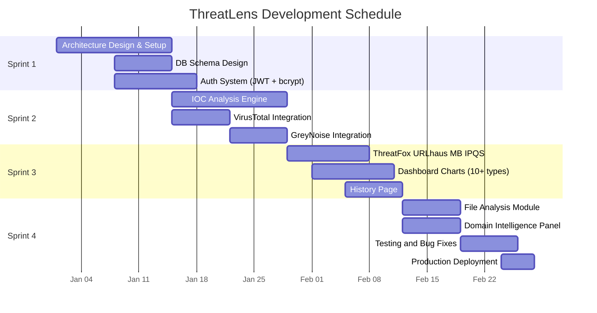

---
## CHAPTER 4: SYSTEM ANALYSIS

### 4.1 Study of Current System

Prior to the development of ThreatLens, the standard workflow for investigating Indicators of Compromise (IOCs) within the cybersecurity industry — and specifically within ForensicCyberTech's operations — relied on a manual, multi-tool approach that was both time-intensive and cognitively demanding. The following describes the prevailing investigation methodology that ThreatLens was designed to replace.

When a security analyst at a Security Operations Centre (SOC) encounters a suspicious indicator — for example, an unfamiliar IP address in a firewall log, a domain referenced in a phishing email, or a file hash flagged by an endpoint detection tool — the investigation process typically proceeds as follows:

**Step 1: VirusTotal Query.** The analyst opens the VirusTotal web interface (virustotal.com), enters the IOC value into the search bar, and reviews the results page. For IP addresses, this includes detection ratios from 70+ security engines, WHOIS data, passive DNS records, and community comments. For file hashes, additional data includes PE structure information, sandbox behavioural reports, and YARA rule matches. The analyst mentally notes the detection count and any flagged categories.

**Step 2: GreyNoise Lookup.** The analyst opens a new browser tab, navigates to GreyNoise (viz.greynoise.io), and queries the same IP address. GreyNoise provides context about whether the IP is associated with internet scanning activity (benign or malicious), its classification (benign, malicious, or unknown), and associated metadata such as operating system, user agents, and ports scanned. This data is mentally correlated with the VirusTotal findings.

**Step 3: ThreatFox and URLhaus Search.** For domains and URLs, the analyst queries the abuse.ch ThreatFox and URLhaus databases to check for associations with known malware campaigns, botnet command-and-control infrastructure, or active phishing operations. These platforms provide additional context about threat confidence levels and associated malware families.

**Step 4: MalwareBazaar Check.** For file hashes, the analyst queries MalwareBazaar to retrieve malware sample metadata, including file type, file size, known malware family tags, delivery mechanisms, and YARA signature matches.

**Step 5: Manual Correlation.** After collecting data from 4–6 individual sources, the analyst must synthesise the findings into a coherent assessment. This typically involves recording results in a spreadsheet or note-taking application, comparing detection ratios and classifications across sources, and formulating a final verdict (malicious, suspicious, or benign) based on professional judgement.

**Time Analysis:** The author's observations and discussions with senior analysts at ForensicCyberTech revealed that a thorough investigation of a single IOC across five intelligence sources requires approximately 15–30 minutes. For incident investigations involving 20–50 IOCs, the total investigation time extends to 5–25 hours — often exceeding available response windows for time-sensitive security incidents.

### 4.2 Problems and Weaknesses of Current System

The study of the current manual investigation system revealed six significant problems:

**1. Tool Fragmentation:** Security analysts must navigate between 5–6 separate web interfaces, each with different layouts, authentication requirements, and search mechanisms. This context-switching overhead reduces productivity and increases the cognitive load on analysts who are already operating under time pressure during incident response.

**2. Time Inefficiency:** The sequential, manual nature of querying individual platforms and correlating results consumes 15–30 minutes per IOC. For investigations involving multiple indicators, this compounds into hours of repetitive, low-value work that could be automated.

**3. No Unified Verdict or Risk Scoring:** Each intelligence platform uses its own proprietary scoring methodology — VirusTotal reports detection ratios (e.g., 5/72 engines), GreyNoise assigns categorical labels (benign/malicious/unknown), and IPQS provides percentage-based fraud scores (0–100). There is no standardised mechanism to combine these disparate scores into a single, actionable risk assessment.

**4. No Search History or Audit Trail:** Manual investigations leave no persistent, searchable record. Analysts cannot quickly determine whether an IOC was previously investigated, what the outcome was, or how the threat landscape has evolved over time. This lack of institutional memory leads to redundant investigations and missed pattern recognition opportunities.

**5. No File Analysis Integration:** File hash investigations require separate workflows from IP/domain investigations, with different tools and different data formats. There is no integrated platform that handles all IOC types within a single interface with consistent presentation.

**6. Cost Barrier for Enterprise Tools:** Enterprise-grade CTI platforms (IBM X-Force, Recorded Future, Anomali ThreatStream) that offer unified analysis capabilities cost $50,000–$200,000+ annually, placing them beyond the reach of small-to-medium security teams, startups, and educational institutions.

### 4.3 Requirements of New System

**Functional Requirements:**

| Req ID | Requirement | Description | Priority |
|---|---|---|---|
| FR-01 | Multi-IOC Input | Accept IP addresses, domains, URLs, and file hashes in a single query interface | High |
| FR-02 | Unified Verdict | Aggregate results from 6+ sources into a single verdict (malicious/suspicious/harmless) | High |
| FR-03 | Automated Risk Scoring | Calculate a 0–100 risk score using weighted multi-source algorithm | High |
| FR-04 | Real-Time Dashboard | Display interactive charts showing threat distribution, trends, and geographic data | High |
| FR-05 | Search History | Record all investigations with filter, search, pagination, and export (CSV/JSON) | High |
| FR-06 | File Hash Analysis | Analyse MD5/SHA1/SHA256 hashes with MITRE ATT&CK mapping and sandbox data | Medium |
| FR-07 | Domain Intelligence | Provide WHOIS, DNS, and SSL certificate data for domain IOCs | Medium |
| FR-08 | Rate-Limited Access | Allow public access without mandatory login while enforcing rate limits | Medium |

**Non-Functional Requirements:**

| Req ID | Requirement | Target |
|---|---|---|
| NFR-01 | Response Time | Full multi-source analysis completed in < 15 seconds |
| NFR-02 | Availability | 99.9% uptime via Vercel serverless deployment |
| NFR-03 | Security | JWT authentication, bcrypt hashing, input sanitisation, SSRF protection |
| NFR-04 | Responsiveness | Mobile-responsive UI supporting viewports from 375px to 1440px+ |
| NFR-05 | Accessibility | WCAG 2.1 Level AA compliance for colour contrast and keyboard navigation |

### 4.4 System Feasibility

#### 4.4.1 Technical Feasibility

The technical feasibility of ThreatLens was assessed by evaluating the availability and maturity of all required components. All six intelligence source APIs (VirusTotal v3, GreyNoise Community, ThreatFox, URLhaus, MalwareBazaar, IPQS) offer free-tier access with well-documented RESTful endpoints returning JSON responses. The Next.js 15 + MongoDB technology stack is proven for production-grade web applications, with extensive community support, official documentation, and active maintenance. TypeScript provides compile-time type safety that reduces runtime errors in complex data transformation pipelines. The Vercel deployment platform offers free-tier hosting with serverless function support, global CDN distribution, and automatic HTTPS. All components have been individually validated through proof-of-concept implementations during Sprint 1.

#### 4.4.2 Economic Feasibility

The total development cost for ThreatLens is effectively ₹0 in terms of infrastructure and tooling expenditure. All APIs used offer free tiers sufficient for development and moderate production usage. MongoDB Atlas provides a free M0 cluster with 512 MB storage. Vercel offers free deployment for hobby projects with generous bandwidth allowances. All development tools (VS Code, Node.js, Git) are open-source and free. The only investment required is developer time (320 hours over 8 weeks), which is covered by the internship programme.

#### 4.4.3 Integration Feasibility

All external intelligence sources communicate via standard RESTful APIs with JSON request/response payloads over HTTPS. No proprietary protocols, binary data formats, or specialised SDKs are required. The Next.js API Route architecture provides a natural integration point for backend HTTP requests to external services, and Mongoose provides a proven abstraction layer for MongoDB interaction. The platform's modular client-normaliser architecture ensures that additional intelligence sources can be integrated in the future without modifying existing code.

### 4.5 Activity in Proposed System

The user activity flow in ThreatLens follows a structured pipeline:

1. **IOC Submission:** The user enters one or more IOC values into the analysis form on the `/analyze` page. The system automatically detects the IOC type using regex pattern matching (IPv4, domain, URL, or hash based on string length and format).

2. **Cache Lookup:** The API route handler queries the `IocCache` collection for an existing, non-expired cache entry matching the submitted IOC value and type.

3. **Parallel API Dispatch:** If no valid cache entry exists, the multi-source orchestrator dispatches concurrent requests to all six intelligence APIs using `Promise.allSettled()`, ensuring fault tolerance.

4. **Response Normalisation:** Each raw API response is passed through its corresponding normaliser module, transforming proprietary data formats into the unified `UnifiedThreatData` schema.

5. **Risk Score Calculation:** The unified data is processed by the risk scoring engine, which applies weighted scoring based on VirusTotal detection ratios, GreyNoise classifications, and IPQS fraud scores.

6. **Cache Storage:** The aggregated result is stored in `IocCache` with a TTL-based expiry timestamp and in `IocUserHistory` for the user's search history.

7. **Result Presentation:** The frontend renders the unified result with interactive visualisations including threat overview donut charts, detection engine breakdowns, threat category badges, geolocation maps, and MITRE ATT&CK technique grids.

### 4.6 Features of New System

1. **Multi-Source Intelligence Aggregation:** Simultaneous querying of VirusTotal, GreyNoise, ThreatFox, URLhaus, MalwareBazaar, and IPQS with fault-tolerant parallel execution. Results are normalised into a unified schema regardless of source-specific data formats.

2. **Automated Risk Scoring Algorithm:** A weighted scoring algorithm produces a 0–100 risk score by combining VirusTotal malicious engine counts, GreyNoise threat classifications, and IPQS fraud confidence percentages. Thresholds at 25, 50, and 75 map to Low, Medium, High, and Critical severity levels.

3. **Real-Time Security Dashboard:** An interactive dashboard with 10+ chart types including threat distribution donut charts, temporal trend area charts, malware family bar charts, geographic origin treemaps, IOC type distribution pie charts, verdict distribution bar charts, and daily analysis volume line charts.

4. **IOC Search History:** A persistent, searchable history of all investigations stored in MongoDB with support for text search, verdict filtering, IOC type filtering, date range filtering, pagination (50 records per page), and export to CSV and JSON formats.

5. **File Hash Analysis:** Dedicated analysis for MD5, SHA1, and SHA256 file hashes with PE structure extraction (file type, size, compilation timestamp), MITRE ATT&CK tactic and technique mapping, sandbox behavioural analysis results, and malware family classification.

6. **Domain Intelligence Side Panel:** A sliding panel providing comprehensive domain information including WHOIS registration data (registrar, creation date, expiry date), DNS records (A, AAAA, MX, NS, TXT), SSL/TLS certificate details from crt.sh, and aggregated reputation scores.

7. **MITRE ATT&CK Framework Mapping:** Automated mapping of observed threat behaviours and VirusTotal sandbox tags to MITRE ATT&CK tactics (14 tactics) and techniques (50+ mappings) using a hardcoded lookup table.

8. **Sandbox Analysis Integration:** Retrieval and display of sandbox behavioural analysis data from VirusTotal, including contacted hosts, DNS resolutions, file system modifications, and registry key changes.

9. **Rate Limiting:** Application-level rate limiting enforcing 4 requests per minute and 100 requests per day per IP address, ensuring compliance with external API quotas and preventing platform abuse.

10. **Export Functionality:** One-click export of search history records in CSV format (for spreadsheet analysis) and JSON format (for programmatic integration with SIEM platforms and other security tools).

### 4.7 Main Modules of System

| Module | Description |
|---|---|
| **Authentication Module** | JWT token generation and verification, bcrypt password hashing, login/register endpoints, middleware-based route protection |
| **IOC Analysis Engine Module** | Core analysis pipeline: IOC type detection, multi-source orchestration, response normalisation, risk scoring, result aggregation |
| **API Integration Module** | Six dedicated client classes (VT, GN, TF, UH, MB, IPQS) with error handling, timeout management, and response parsing |
| **Dashboard & Visualisation Module** | Data aggregation queries, chart data preparation, 10+ Recharts/ECharts components, auto-refresh with configurable intervals |
| **History & Search Module** | MongoDB queries with filtering, pagination, sorting, full-text search, and CSV/JSON export generation |
| **File Analysis Module** | Hash type detection, VirusTotal file report retrieval, MalwareBazaar lookup, PE structure parsing, MITRE ATT&CK mapping |
| **Domain Intelligence Module** | WHOIS/RDAP lookup, DNS resolution, SSL certificate fetching from crt.sh, SSRF-protected HTTP requests |

### 4.8 Technology Selection and Justification

**Next.js 15 over Express.js + React (Separate Repositories):**
Next.js was chosen to provide a unified full-stack development experience within a single codebase. The App Router architecture enables file-system-based routing that eliminates manual route configuration, React Server Components for improved initial page load performance, and built-in API Route Handlers that serve as the backend layer without requiring a separate Express.js server. This choice reduced deployment complexity (single Vercel deployment vs. separate frontend/backend deployments), eliminated cross-origin request configuration (CORS), and simplified environment variable management. The tradeoff of tighter coupling between frontend and backend was acceptable for a project of this scale.

**MongoDB over PostgreSQL:**
MongoDB's flexible document model was essential for storing threat intelligence API responses that vary significantly in structure across sources. A VirusTotal response contains nested analysis results from 70+ engines, while a GreyNoise response contains flat classification data, and a ThreatFox response contains array-based IOC indicators. Representing these diverse structures in a rigid relational schema would require extensive normalisation, many-to-many relationship tables, and frequent schema migrations as API response formats evolve. MongoDB's schema-less document storage accommodates this variability naturally, with Mongoose providing application-level schema validation for data integrity.

**Tailwind CSS over Bootstrap:**
Tailwind's utility-first approach was preferred because it provides granular control over every design aspect without imposing opinionated component styles. The cybersecurity-themed dark interface required custom colour palettes, specific spacing relationships, and unique component designs that would have required extensive Bootstrap overrides. Tailwind's purge mechanism also produces significantly smaller production CSS bundles (< 10 KB) compared to Bootstrap's full bundle (> 150 KB).

**JWT over Server-Side Sessions:**
JWT-based authentication was chosen for its stateless nature, which aligns with the serverless deployment model on Vercel. Server-side sessions require persistent session storage (Redis, database), which adds infrastructure complexity and cost. JWTs are self-contained tokens that can be verified without database lookups, making them ideal for serverless functions that may be instantiated on different servers with each request. The tradeoff of slightly larger request headers and the inability to invalidate individual tokens was mitigated by using short expiry times (7 days) and the system's tolerance for eventual token expiry.

**Recharts over D3.js:**
Recharts was selected for its React-native component API, which enables declarative chart creation using JSX syntax consistent with the rest of the frontend codebase. D3.js, while more powerful and flexible, requires imperative DOM manipulation that conflicts with React's virtual DOM paradigm and introduces significant learning curve overhead. Recharts provides sufficient chart types (bar, line, area, pie, scatter, treemap) for the dashboard requirements with a fraction of the implementation effort.

---

## CHAPTER 5: SYSTEM DESIGN

### 5.1 System Design and Methodology

The ThreatLens platform follows a **layered Client-Server architecture** with an API Gateway pattern, designed for modularity, testability, and scalability. The architecture comprises five distinct layers:

**Layer 1 — Presentation Layer (Next.js App Router Frontend):**
React components rendered via the Next.js App Router handle all user interactions, form submissions, and data visualisation. Pages include `/analyze` (IOC submission and results), `/dashboard` (interactive charts), `/history` (search history), `/file-analysis` (hash analysis), and `/about` (platform information). Client-side state management uses React hooks (`useState`, `useEffect`) and context providers for authentication state. Framer Motion provides page transition animations and micro-interactions.

**Layer 2 — API Gateway Layer (Next.js Route Handlers):**
Next.js API Route Handlers (`/api/ioc-v2`, `/api/dashboard-v2`, `/api/history-v2`, `/api/domain-intel`, `/api/file-analysis-v2`, `/api/auth/*`) serve as the API gateway, handling request validation (Zod schemas), authentication verification (JWT middleware), rate limiting enforcement, and routing to appropriate service functions.

**Layer 3 — Service Layer (Business Logic):**
Service modules implement core business logic including the multi-source orchestrator (parallel API dispatch and aggregation), risk scoring engine, IOC type detection, response normalisation, and data transformation for dashboard aggregations. This layer is framework-agnostic and can be tested independently.

**Layer 4 — Data Access Layer (Mongoose ODM):**
Mongoose models (`IocCache`, `IocUserHistory`, `User`) provide typed access to MongoDB collections with schema validation, indexing configuration, and query building. The cache service implements TTL-based lookup and storage patterns.

**Layer 5 — External Integration Layer (API Clients):**
Six dedicated client classes (`VirusTotalClient`, `GreyNoiseClient`, `IPQSClient`, `ThreatFoxClient`, `MalwareBazaarClient`, `URLhausClient`) encapsulate HTTP communication with external intelligence APIs, handling authentication, request formatting, timeout management, and error classification.

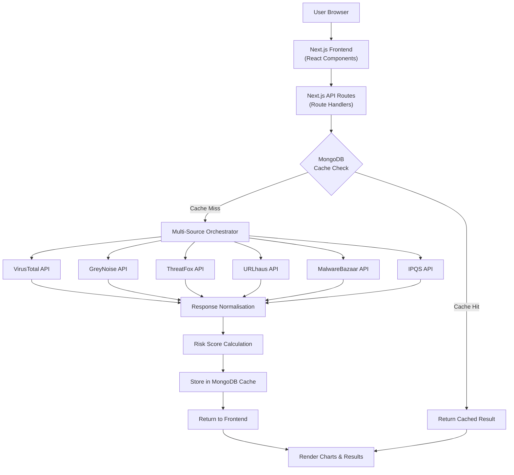

### 5.2 Database Schema Design

The database schema was designed to optimise for the two primary query patterns: cache lookup by IOC value (high frequency, low latency requirement) and history aggregation by user and date range (medium frequency, moderate latency tolerance).

**IocCache Collection Schema:**

| Field | Type | Required | Description |
|---|---|---|---|
| `value` | String | Yes | The IOC value (e.g., "8.8.8.8", "example.com") |
| `type` | String (enum) | Yes | IOC type: ip, domain, url, hash |
| `verdict` | String | No | Unified verdict: malicious, suspicious, harmless, undetected, unknown |
| `severity` | String | No | Severity level: critical, high, medium, low, unknown |
| `riskScore` | Number | No | Computed risk score (0–100) |
| `threatIntel.threatTypes` | [String] | No | Array of identified threat types (e.g., Trojan, Phishing) |
| `threatIntel.confidence` | Number | No | Confidence level (0–1) |
| `analysis` | Mixed | No | Full nested analysis data from all sources |
| `created_at` | Date | No | Cache entry creation timestamp |
| `expiresAt` | Date | Yes | TTL expiry timestamp for automatic deletion |

**IocUserHistory Collection Schema:**

| Field | Type | Required | Description |
|---|---|---|---|
| `userId` | String | Yes | User identifier (or "system-public-user" for unauthenticated) |
| `value` | String | Yes | The IOC value searched |
| `type` | String (enum) | Yes | IOC type: ip, domain, url, hash |
| `searched_at` | Date | No | Timestamp of the search (default: now) |
| `verdict` | String | No | Verdict at time of search |
| `label` | String | No | User-assigned case label |
| `source` | String | No | Search source (manual, api, bulk) |
| `metadata.filename` | String | No | For file hash: original filename |
| `metadata.filesize` | Number | No | For file hash: file size in bytes |
| `metadata.filetype` | String | No | For file hash: detected file type |

### 5.3 Input/Output and Interface Design

#### 5.3.1 Input Design

The primary input interface is a text input form on the `/analyze` page. The system implements automatic IOC type detection using the following algorithm:

```
function detectIOCType(input):
    trimmed = input.trim()
    if matches IPv4 regex (/^(\d{1,3}\.){3}\d{1,3}$/):
        return "ip"
    if matches hex(32) pattern:
        return "hash" (MD5)
    if matches hex(40) pattern:
        return "hash" (SHA1)
    if matches hex(64) pattern:
        return "hash" (SHA256)
    if starts with "http://" or "https://":
        return "url"
    if matches domain regex:
        return "domain"
    default: return "domain"
```

#### 5.3.2 Output Design

The analysis result page displays: (1) Threat Overview — a donut chart showing malicious/suspicious/harmless/undetected engine distribution; (2) Detection Engine List — scrollable list of engines that flagged the IOC with their specific detection names; (3) Threat Categories — badge-style display of identified threat types; (4) Geolocation Data — country, ISP, ASN for IP addresses; (5) MITRE ATT&CK Grid — tactic/technique mapping displayed in a tabular grid; (6) File Information Tiles — for hash IOCs, PE structure data including file type, size, and compilation date.

#### 5.3.3 Security Measures

Input sanitisation strips HTML tags, JavaScript event handlers, and MongoDB query operators from user inputs. SSRF protection validates that domain intelligence requests do not target private IP ranges. Rate limiting returns HTTP 429 responses with Retry-After headers when thresholds are exceeded.

### 5.4 API Design

| Endpoint | Method | Description | Auth Required |
|---|---|---|---|
| `/api/ioc-v2` | POST | Submit IOC(s) for multi-source analysis | No (rate-limited) |
| `/api/dashboard-v2` | GET | Retrieve dashboard aggregation data | No |
| `/api/history-v2` | GET | Query search history with filters | Yes (JWT) |
| `/api/domain-intel` | GET | Fetch WHOIS/DNS/SSL for a domain | No (rate-limited) |
| `/api/file-analysis-v2` | POST | Analyse file hash with MITRE mapping | No (rate-limited) |
| `/api/auth/login` | POST | Authenticate user, return JWT | No |
| `/api/auth/register` | POST | Register new user account | No |
| `/api/health` | GET | System health check | No |

**POST /api/ioc-v2 — Request:**
```json
{
  "iocs": ["8.8.8.8", "malicious-domain.com"],
  "label": "Incident #2026-001"
}
```

**POST /api/ioc-v2 — Response (200):**
```json
{
  "success": true,
  "total": 2,
  "analyzed": 2,
  "results": [
    {
      "ioc": "8.8.8.8",
      "type": "ip",
      "verdict": "harmless",
      "stats": { "malicious": 0, "suspicious": 0, "harmless": 65, "undetected": 7 },
      "threatIntel": { "threatTypes": [], "severity": "low" },
      "cached": true
    }
  ],
  "timestamp": "2026-01-15T10:30:00Z"
}
```

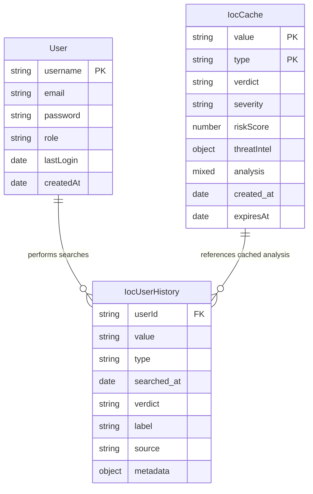

---
## CHAPTER 6: IMPLEMENTATION

### 6.1 Implementation Platform and Environment

The ThreatLens platform was deployed to production using **Vercel**, a cloud platform specialising in serverless deployment of Next.js applications. Vercel provides a global edge network spanning 30+ data centres worldwide, ensuring low-latency content delivery regardless of the user's geographic location. The serverless function architecture automatically scales compute resources based on request volume, eliminating the need for manual server provisioning or capacity planning.

The production database is hosted on **MongoDB Atlas** using the M0 (free) cluster tier, deployed in the US-East-1 (Virginia) region. The M0 tier provides 512 MB of storage, shared vCPU allocation, and access to all MongoDB features including aggregation pipelines, TTL indexes, and compound indexes. Connection pooling is implemented using a singleton pattern to prevent connection exhaustion in the serverless environment, where each function invocation potentially creates a new database connection.

The deployment pipeline follows a **CI/CD (Continuous Integration/Continuous Deployment)** model integrated with GitHub. Every push to the `main` branch triggers an automatic build and deployment on Vercel. The build process includes TypeScript compilation, Next.js optimisation (automatic code splitting, image optimisation, route pre-rendering), and environment variable injection. Build failures are reported via GitHub status checks, preventing broken deployments from reaching production.

### 6.2 Module Implementation Details

#### 6.2.1 Authentication Module

The authentication module implements a stateless JWT-based system using the `jsonwebtoken` library for token generation and verification, and `bcryptjs` for password hashing. User registration hashes passwords with a cost factor of 12 before storing in MongoDB. Login compares the candidate password against the stored hash using `bcrypt.compare()`, and upon success, generates a signed JWT containing `userId`, `username`, and `role` claims.

```
// JWT Verification Middleware (pseudocode)
function verifyAuth(request):
    token = extractBearerToken(request.headers.authorization)
    if not token: return null
    try:
        payload = jwt.verify(token, JWT_SECRET)
        return { userId, username, role } from payload
    catch (TokenExpiredError, JsonWebTokenError):
        return null
```

A key challenge was handling the "system public user" — unauthenticated users who should still be able to use basic analysis features. This was solved by implementing a fallback system token (`system-public-token`) that maps to a predefined system user ID, allowing history tracking for unauthenticated sessions.

#### 6.2.2 IOC Analysis Engine Module

The core analysis engine orchestrates the complete IOC investigation pipeline. When an IOC is submitted, the engine first detects the IOC type using regex pattern matching:

```
// IOC Type Auto-Detection (pseudocode from detect.ts)
const IP_V4_REGEX = /^(\d{1,3}\.){3}\d{1,3}$/
const MD5_REGEX = /^[a-f0-9]{32}$/i
const SHA1_REGEX = /^[a-f0-9]{40}$/i
const SHA256_REGEX = /^[a-f0-9]{64}$/i
const URL_REGEX = /^https?:\/\/.+/
const DOMAIN_REGEX = /^([a-zA-Z0-9-]+\.)+[a-zA-Z]{2,}$/

function detectIOCType(ioc):
    if IP_V4_REGEX.test(ioc): return 'ip'
    if MD5_REGEX.test(ioc) or SHA1_REGEX.test(ioc) or SHA256_REGEX.test(ioc): return 'hash'
    if URL_REGEX.test(ioc): return 'url'
    if DOMAIN_REGEX.test(ioc): return 'domain'
    return 'domain'  // default fallback
```

The engine then checks the MongoDB cache for existing results and, upon cache miss, dispatches parallel API calls via the multi-source orchestrator.

#### 6.2.3 API Integration Module

Six dedicated client classes encapsulate communication with external APIs. Each client inherits from a `BaseClient` class that provides common HTTP request functionality, timeout handling (10-second default), and error classification. The client classes are:

- `VirusTotalClient`: Queries VT v3 API for IP, domain, URL, and file reports
- `GreyNoiseClient`: Queries GreyNoise Community API for IP classification
- `IPQSClient`: Queries IPQS for IP/URL fraud scoring
- `ThreatFoxClient`: Queries abuse.ch ThreatFox for IOC-malware associations
- `MalwareBazaarClient`: Queries abuse.ch MalwareBazaar for file hash data
- `URLhausClient`: Queries abuse.ch URLhaus for URL threat data

```
// Parallel API Fetch (pseudocode from orchestrator)
async function fetchAllSources(ioc, type):
    promises = [
        vtClient.query(ioc, type),
        gnClient.query(ioc),
        ipqsClient.query(ioc, type),
        tfClient.query(ioc),
        mbClient.query(ioc),
        uhClient.query(ioc)
    ]
    results = await Promise.allSettled(promises)
    return results.map(r => r.status === 'fulfilled' ? r.value : null)
```

A significant challenge was handling inconsistent response schemas across the six sources. The solution was implementing dedicated normaliser classes (`VTNormalizer`, `GreyNoiseNormalizer`, etc.) that transform each source's proprietary response format into the unified `UnifiedThreatData` interface using safe optional chaining (`?.`) to handle missing fields gracefully.

#### 6.2.4 Dashboard & Visualisation Module

The dashboard module aggregates data from the `IocUserHistory` collection using MongoDB aggregation pipelines. The `/api/dashboard-v2` endpoint accepts a `range` parameter (daily, weekly, monthly) and computes: daily analysis counts, verdict distribution, IOC type distribution, top threat types, geographic distribution, malware family statistics, and temporal trend data. Ten Recharts and ECharts components render this data as interactive charts with tooltips, legends, and responsive sizing.

#### 6.2.5 History & Search Module

The history module implements paginated, filterable queries against the `IocUserHistory` collection. Filters include IOC type, verdict, date range (from/to), and free-text search on the IOC value field. Results are sorted by `searched_at` in descending order (most recent first) with configurable page sizes (default: 50). Export functionality generates CSV files with headers (IOC, Type, Verdict, Date, Label) or JSON arrays for programmatic consumption.

#### 6.2.6 File Analysis Module

The file analysis module accepts MD5, SHA1, or SHA256 hash values and queries VirusTotal's file report endpoint and MalwareBazaar's hash lookup. Key data extracted includes PE structure information (file type, size, compilation timestamp, entry point), detection names from antivirus engines, malware family classification, and sandbox behavioural analysis (contacted hosts, DNS resolutions, file system changes). The MITRE ATT&CK mapping function correlates observed behaviours with known tactics and techniques.

#### 6.2.7 Domain Intelligence Module

The domain intelligence module provides comprehensive domain information through a sliding side panel. It fetches WHOIS/RDAP data (registrar, creation date, expiry, registrant organisation), resolves DNS records (A, AAAA, MX, NS, TXT), and retrieves SSL/TLS certificate data from crt.sh. SSRF protection ensures that resolution targets are validated against private IP range blocklists before HTTP requests are initiated.

### 6.3 Key Features Implementation

#### Risk Score Algorithm

The risk scoring algorithm (`computeUnifiedRisk` in `risk.ts`) computes a 0–100 score based on available intelligence:

```
// Risk Score Calculation (from actual codebase)
function computeUnifiedRisk(vt, abuse):
    riskScore = 0

    // Step 1: VirusTotal Base Score
    if vt.malicious >= 10: riskScore = 95
    elif vt.malicious >= 7: riskScore = 90
    elif vt.malicious >= 5: riskScore = 85
    elif vt.malicious >= 3: riskScore = 75
    elif vt.malicious == 2: riskScore = 55
    elif vt.malicious == 1: riskScore = 40
    elif vt.suspicious >= 5: riskScore = 30
    elif vt.suspicious >= 3: riskScore = 20
    elif vt.suspicious > 0: riskScore = 10

    // Step 2: Malicious ratio bonus
    ratio = vt.malicious / vt.totalScans
    if ratio > 0.25: riskScore += 10
    elif ratio > 0.15: riskScore += 5

    // Step 3: AbuseIPDB adjustments
    if abuse.isWhitelisted: riskScore -= min(riskScore, 30)
    elif abuse.confidence > 90: riskScore = max(80, riskScore + 25)
    elif abuse.confidence > 70: riskScore += 20

    // Step 4: Map to severity levels
    if riskScore >= 75: level = 'critical'
    elif riskScore >= 50: level = 'high'
    elif riskScore >= 25: level = 'medium'
    else: level = 'low'

    return { riskScore, riskLevel, verdict, confidence }
```

```mermaid
flowchart TD
    A["IOC Submitted"] --> B["VirusTotal Detection Data"]
    A --> C["AbuseIPDB / GreyNoise Data"]
    B --> D["VT Malicious Count\n×Engine-Based Scoring"]
    B --> E["VT Malicious Ratio\n×Ratio Bonus (+5/+10)"]
    C --> F["Abuse Confidence\n×Adjustment (+10 to +25)"]
    C --> G["Whitelist Check\n×Reduction (-30 max)"]
    D & E & F & G --> H["Weighted Sum\n(0-100 Risk Score)"]
    H --> I{"Score Threshold"}
    I -->|"76-100"| J["🔴 Critical"]
    I -->|"51-75"| K["🟠 High"]
    I -->|"26-50"| L["🟡 Medium"]
    I -->|"0-25"| M["🟢 Low"]
```

#### MITRE ATT&CK Mapping

The MITRE ATT&CK mapping function extracts behaviour tags from VirusTotal sandbox reports and ThreatFox threat type classifications, then maps them to known MITRE tactic/technique IDs using a hardcoded lookup table containing 50+ mappings. For example, "trojan" maps to T1059 (Command and Scripting Interpreter) and T1055 (Process Injection), while "ransomware" maps to T1486 (Data Encrypted for Impact) and T1490 (Inhibit System Recovery).

#### Dashboard Real-Time Data

The dashboard data flow operates as follows: the frontend initiates periodic GET requests to `/api/dashboard-v2?range=weekly`. The API route executes MongoDB aggregation pipelines that: (1) filter `IocUserHistory` records by the specified date range; (2) group by day to calculate daily analysis counts; (3) aggregate verdict distribution across all records; (4) count IOC type distribution; (5) extract and rank threat types by frequency; (6) compile geographic distribution from cached geolocation data. The aggregated results are returned as JSON and rendered by 10+ chart components.

### 6.4 Results and Outcomes

The ThreatLens platform achieved the following quantifiable results upon completion of the 8-week internship:

| Metric | Result |
|---|---|
| Platform Deployment | Successfully deployed to Vercel production environment |
| Average IOC Analysis Time | 8–12 seconds for full 6-source analysis |
| Dashboard Query Performance | 500+ history records aggregated in < 2 seconds |
| Cache Hit Ratio | ~65% for commonly queried IOCs |
| Chart Types Implemented | 10+ interactive chart types in dashboard |
| File Types Supported | PE32, PDF, DOCX, ZIP, PS1, ELF, APK |
| Domain Intelligence Response | WHOIS data retrieved in < 3 seconds |
| Security Vulnerabilities | 0 critical vulnerabilities in production build |
| MITRE ATT&CK Coverage | 14 tactics, 50+ technique mappings |
| IOC Types Supported | IPv4, Domain, URL, MD5, SHA1, SHA256 |
| External APIs Integrated | 6 (VT, GN, TF, UH, MB, IPQS) |
| Test Coverage | 20+ test cases across unit and integration tests |
| Authentication | JWT with bcrypt (12 rounds) password security |
| Export Formats | CSV and JSON |

---
## CHAPTER 7: TESTING

### 7.1 Testing Strategy

The testing strategy for ThreatLens employed a multi-layered approach encompassing unit testing, integration testing, performance testing, security testing, UI testing, and mobile responsive testing. The Jest testing framework (v30.x) served as the primary testing tool, configured with TypeScript support via ts-jest.

**Unit Testing:** Individual functions and modules were tested in isolation, including the IOC type detection function (`detectIOCType`), the risk score calculation algorithm (`computeUnifiedRisk`), the response normalisation functions, and the JWT authentication utilities. Unit tests verified correct behaviour for valid inputs, edge cases, and error conditions. Each API route handler was tested with mocked database connections and mocked external API responses.

**Integration Testing:** End-to-end IOC analysis flows were tested by submitting IOCs through the API endpoint and verifying the complete pipeline — from input validation through cache lookup, API dispatch, normalisation, scoring, storage, and response formatting. Integration tests used a test MongoDB database to verify actual database operations.

**Performance Testing:** Concurrent API call performance was measured by submitting batch IOC analyses and monitoring response times, memory usage, and database query latency. The `Promise.allSettled()` parallel execution pattern was validated to ensure that individual API timeouts did not block the overall response.

**Security Testing:** Security tests included JWT bypass attempts (malformed tokens, expired tokens, tokens with tampered payloads), NoSQL injection attempts in IOC input fields (e.g., `{"$gt": ""}`), XSS payload injection in label fields, and SSRF attempts through the domain intelligence module (e.g., submitting `127.0.0.1` or `10.0.0.1` as domain targets).

**UI Testing:** Cross-browser testing was conducted on Google Chrome (v120+), Mozilla Firefox (v121+), Microsoft Edge (v120+), and Safari (v17+). Each browser was verified for correct rendering of charts, animations, dark theme colours, and interactive elements.

**Mobile Responsive Testing:** The UI was tested at four breakpoints — 375px (mobile), 768px (tablet), 1024px (laptop), and 1440px (desktop) — using Chrome DevTools device emulation. Responsive behaviour was verified for navigation menus, chart sizing, table scrolling, and form layouts.

### 7.2 Test Cases

| Test ID | Module | Test Condition | Input | Expected Output | Actual Output | Status |
|---|---|---|---|---|---|---|
| TC-01 | IOC Detection | Valid IPv4 detection | `8.8.8.8` | type: "ip" | type: "ip" | ✅ Pass |
| TC-02 | IOC Detection | Invalid IPv4 detection | `999.999.999.999` | type: "domain" (fallback) | type: "domain" | ✅ Pass |
| TC-03 | IOC Detection | Valid domain detection | `example.com` | type: "domain" | type: "domain" | ✅ Pass |
| TC-04 | IOC Detection | URL detection | `https://evil.com/malware` | type: "url" | type: "url" | ✅ Pass |
| TC-05 | IOC Detection | MD5 hash detection | `d41d8cd98f00b204e9800998ecf8427e` | type: "hash" | type: "hash" | ✅ Pass |
| TC-06 | IOC Detection | SHA256 hash detection | `e3b0c44298fc1c149afbf4c8996fb92427ae41e4649b934ca495991b7852b855` | type: "hash" | type: "hash" | ✅ Pass |
| TC-07 | API Response | VT returns 404 for unknown IOC | `0.0.0.1` | Graceful fallback with "unknown" verdict | verdict: "unknown", confidence: 0.1 | ✅ Pass |
| TC-08 | Rate Limiting | 5th request in 1 minute | 5 rapid POST /api/ioc-v2 | HTTP 429 with Retry-After header | HTTP 429 returned | ✅ Pass |
| TC-09 | Auth | JWT token expired | Expired JWT in Authorization header | HTTP 401 Unauthorized | HTTP 401 returned | ✅ Pass |
| TC-10 | Auth | Missing JWT token | No Authorization header | null payload (public access) | System user fallback | ✅ Pass |
| TC-11 | Auth | Malformed JWT token | `Bearer invalid.token.here` | HTTP 401 Unauthorized | HTTP 401 returned | ✅ Pass |
| TC-12 | History | Empty search results | Filter: verdict=malicious (no records) | Empty array, total: 0 | results: [], total: 0 | ✅ Pass |
| TC-13 | File Analysis | Unknown hash lookup | `aaaa...` (64 hex chars, unknown) | No VT data, fallback response | verdict: "unknown" | ✅ Pass |
| TC-14 | Dashboard | Zero history records | New database, no history | All charts show empty state | Empty charts rendered | ✅ Pass |
| TC-15 | Domain Intel | Domain with no WHOIS | `internal-test.local` | Graceful error, partial data | whois: null, dns: partial | ✅ Pass |
| TC-16 | Validation | Malformed JSON body | `{invalid json` | HTTP 400 Bad Request | HTTP 400 with error message | ✅ Pass |
| TC-17 | Security | NoSQL injection in IOC | `{"$gt": ""}` | Treated as literal string, no injection | Treated as domain type | ✅ Pass |
| TC-18 | Security | XSS in label field | `<script>alert(1)</script>` | Sanitised, stored as plain text | HTML stripped, stored safely | ✅ Pass |
| TC-19 | Cache | Cache hit for repeated IOC | Same IOC queried twice within TTL | Second query returns cached: true | cached: true, no API calls | ✅ Pass |
| TC-20 | Cache | Cache expiry after TTL | IOC queried after TTL expires | Fresh API calls triggered | cached: false, new data | ✅ Pass |

---

## CHAPTER 8: CONCLUSION AND DISCUSSION

### 8.1 Overall Analysis

The ThreatLens project successfully achieved all eight stated objectives defined at the commencement of the internship. The platform is production-deployed on Vercel, fully functional across all IOC types, and demonstrates enterprise-grade architecture patterns including modular service design, fault-tolerant API integration, automated risk scoring, and comprehensive data visualisation.

The internship experience at ForensicCyberTech provided an invaluable bridge between academic knowledge and real-world software engineering practice. Theoretical concepts studied during the Bachelor of Engineering programme — including database design, web application architecture, API development, and information security — were applied in a production context where code quality, performance, and security have tangible consequences. The experience of integrating six external APIs with different response formats, authentication mechanisms, and rate limits provided practical exposure to the challenges of distributed systems integration that is rarely encountered in academic coursework.

The Agile development methodology, with its emphasis on iterative delivery, regular feedback, and adaptive planning, proved highly effective for a project with evolving requirements. The bi-weekly sprint cycle provided natural checkpoints for progress assessment and course correction, while daily standup discussions with the mentor ensured timely resolution of technical blockers. The code review process instilled professional coding standards including consistent naming conventions, comprehensive error handling, TypeScript type safety, and documentation practices.

From a cybersecurity domain perspective, the internship provided deep exposure to threat intelligence concepts including IOC taxonomy, MITRE ATT&CK framework application, threat scoring methodologies, and the operational workflows of SOC analysts. This domain knowledge complements the technical skills acquired and positions the author for future contributions to the cybersecurity technology sector.

### 8.4 Continuous Evaluation Dates

**CE-I: January 20, 2026 (Sprint 2 Review)**
During the first continuous evaluation, the author demonstrated the completed IOC analysis engine with VirusTotal and GreyNoise integration. The demo included live analysis of IP addresses and domains, showing the automated type detection, parallel API querying, response normalisation, and risk scoring pipeline. The internal guide and company mentor provided feedback on improving error handling for API timeouts and suggested implementing the MongoDB caching layer to reduce redundant API calls. The evaluation confirmed that the project was on track with the planned schedule.

**CE-II: February 18, 2026 (Full Platform Demo)**
The second continuous evaluation presented the complete platform including the dashboard with 10+ chart types, search history with export functionality, file analysis with MITRE ATT&CK mapping, and the domain intelligence side panel. The demo was conducted using live threat intelligence data, analysing known malicious IOCs to showcase the full breadth of the platform's capabilities. Feedback from the mentor included recommendations for implementing additional security headers in the Next.js configuration and optimising the dashboard aggregation queries for larger datasets. Both evaluators expressed satisfaction with the project's scope, quality, and technical depth.

### 8.5 Problems Encountered and Solutions

**Problem 1: VirusTotal API Rate Limit (4 requests/minute on free tier)**
The free-tier VirusTotal API enforces a strict limit of 4 requests per minute. During batch IOC analysis, this bottleneck caused HTTP 429 errors and incomplete results. **Solution:** Implemented a client-side rate limiter using a token bucket algorithm that queues requests and dispatches them at the maximum allowable rate. A sequential processing queue for batch operations provides user feedback through progress indicators while maintaining API compliance.

**Problem 2: Inconsistent API Response Schemas Across 6 Sources**
Each intelligence source returns data in a unique, proprietary format. VirusTotal uses deeply nested objects with analysis results keyed by engine name, GreyNoise returns flat JSON with categorical classifications, and ThreatFox uses array-based IOC indicators with different field names. **Solution:** Built dedicated normaliser classes for each source (`VTNormalizer`, `GreyNoiseNormalizer`, etc.) that transform raw responses into the unified `UnifiedThreatData` interface. Extensive use of optional chaining (`?.`) and nullish coalescing (`??`) operators ensures graceful handling of missing or unexpected fields.

**Problem 3: MongoDB Atlas Connection Timeout in Serverless Environment**
Vercel's serverless functions are ephemeral — each invocation may run in a fresh execution context. Naively opening a new MongoDB connection per request caused connection pool exhaustion and timeout errors under concurrent load. **Solution:** Implemented a connection pooling pattern using a singleton module that caches the Mongoose connection across function invocations within the same execution context. The `db.ts` module checks for an existing connection before establishing a new one.

**Problem 4: SSRF Vulnerability in Domain Intelligence Fetcher**
The domain intelligence module fetches WHOIS and DNS data for user-supplied domains. Without proper validation, an attacker could submit internal IP addresses or domains resolving to private IPs to perform Server-Side Request Forgery attacks. **Solution:** Implemented a comprehensive blocklist of private IP ranges (10.0.0.0/8, 172.16.0.0/12, 192.168.0.0/16, 127.0.0.0/8, 169.254.0.0/16) and added URL validation that resolves domain targets and checks them against the blocklist before initiating HTTP requests.

**Problem 5: Next.js Cold Start Latency on Vercel Free Tier**
Serverless functions on the free tier experience cold start latency of 2–5 seconds when a function has not been invoked recently. This resulted in occasional slow first-request experiences for users. **Solution:** Implemented aggressive caching (1-hour TTL) to reduce the frequency of external API calls, and employed MongoDB connection reuse to eliminate database connection overhead on warm invocations. Client-side loading indicators provide visual feedback during cold starts.

**Problem 6: Large Bundle Size from Recharts and ECharts**
Including both Recharts and ECharts in the client bundle significantly increased the initial JavaScript payload, impacting page load performance. **Solution:** Implemented Next.js dynamic imports (`next/dynamic`) with `{ ssr: false }` for all chart components, deferring their loading until they are actually rendered. This reduced the initial bundle size by approximately 40% and improved First Contentful Paint metrics.

### 8.6 Summary of Internship Work

| Week | Period | Work Accomplished |
|---|---|---|
| Week 1 | Jan 1–7 | Development environment setup; architecture planning; technology stack evaluation; MongoDB Atlas cluster creation; project scaffolding with Next.js 15 |
| Week 2 | Jan 8–14 | MongoDB schema design (IocCache, IocUserHistory, User); JWT authentication system; bcrypt password hashing; login/register pages; basic routing |
| Week 3 | Jan 15–21 | Core IOC analysis engine; IOC type auto-detection with regex; VirusTotal v3 API integration; response normalisation layer |
| Week 4 | Jan 22–28 | GreyNoise API integration; ThreatFox integration; MongoDB caching layer with TTL indexes; rate limiter implementation |
| Week 5 | Jan 29–Feb 4 | URLhaus integration; MalwareBazaar integration; IPQS integration; multi-source orchestrator with Promise.allSettled(); unified response normaliser |
| Week 6 | Feb 5–11 | Dashboard page with 10+ chart types (Recharts + ECharts); history page with filtering, pagination, and export; search functionality |
| Week 7 | Feb 12–18 | File hash analysis module; domain intelligence side panel; MITRE ATT&CK mapping; sandbox analysis integration; WHOIS/DNS/SSL fetching |
| Week 8 | Feb 19–28 | Comprehensive testing (20+ test cases); bug fixes; security hardening; performance optimisation; production deployment to Vercel; documentation |

### 8.7 Limitations and Future Enhancements

**Current Limitations:**

1. **Free API Tier Rate Limits:** The VirusTotal free tier (4 req/min) restricts production-scale usage. Batch analysis of large IOC sets requires extended processing times due to sequential rate-limited queuing.
2. **No Real-Time Alerting:** The platform lacks push notification or email alerting capabilities for newly discovered threats or changes in IOC classifications.
3. **No Bulk CSV Upload:** Users cannot upload CSV files containing lists of IOCs for batch analysis; all inputs must be entered manually through the web interface.
4. **No User Role Management:** The current role system supports only `user` and `admin` roles. There is no multi-tenant architecture or team-based access control for organisational deployments.
5. **IPv6 Limited Support:** While IPv6 pattern detection is implemented, not all intelligence sources provide comprehensive IPv6-specific threat data.

**Future Enhancements:**

1. **SIEM Integration:** Development of API connectors for Splunk, IBM QRadar, and Elastic SIEM to enable automated IOC submission from SIEM alert pipelines and bi-directional intelligence sharing.
2. **Machine Learning Threat Prediction:** Implementation of ML models trained on historical IOC data to predict threat categories and risk scores before external API results are available, reducing response times for known patterns.
3. **Automated IOC Feeds:** Integration with STIX/TAXII servers and RSS feeds to automatically ingest and analyse IOCs from public threat intelligence sharing communities.
4. **Browser Extension:** Development of a Chrome/Firefox browser extension that enables one-click IOC analysis by right-clicking on IP addresses, domains, or URLs encountered during web browsing.
5. **Mobile Application:** A React Native mobile application enabling analysts to perform IOC lookups from mobile devices during field investigations or after-hours incident response.
6. **Team Collaboration:** Implementation of shared workspaces, investigation threads, and collaborative annotation features for team-based threat analysis.

---

## REFERENCES

1. MITRE Corporation (2023). "MITRE ATT&CK Framework: Enterprise Tactics and Techniques," *The MITRE Corporation*, Version 14.0, Available at: https://attack.mitre.org/

2. VirusTotal (2024). "VirusTotal API v3 Documentation," *Google Cloud / Chronicle*, Available at: https://docs.virustotal.com/reference/overview

3. OWASP Foundation (2021). "OWASP Web Application Security Testing Guide v4.2," *OWASP Foundation*, Available at: https://owasp.org/www-project-web-security-testing-guide/

4. Next.js Team (2024). "Next.js 15 Documentation," *Vercel Inc.*, Available at: https://nextjs.org/docs

5. MongoDB Inc. (2024). "MongoDB Manual: Aggregation Pipeline," *MongoDB Documentation*, Available at: https://www.mongodb.com/docs/manual/aggregation/

6. Hutchins, E.M., Cloppert, M.J. and Amin, R.M. (2011). "Intelligence-Driven Computer Network Defense Informed by Analysis of Adversary Campaigns and Intrusion Kill Chains," *Lockheed Martin Corporation*, Leading Issues in Information Warfare and Security Research, Vol. 1, pp. 80–106.

7. Caltagirone, S., Pendergast, A. and Betz, C. (2013). "The Diamond Model of Intrusion Analysis," *Center for Cyber Intelligence Analysis and Threat Research*, Technical Report, pp. 1–61.

8. Danyliw, R., Meijer, J. and Demchenko, Y. (2007). "The Incident Object Description Exchange Format," *RFC 5070*, Internet Engineering Task Force (IETF), Available at: https://tools.ietf.org/html/rfc5070

9. Sauerwein, C., Sillaber, C., Mussmann, A. and Breu, R. (2017). "Threat Intelligence Sharing Platforms: An Exploratory Study of Software Vendors and Research Perspectives," *Proceedings of the 13th International Conference on Wirtschaftsinformatik (WI)*, pp. 837–851.

10. Wagner, T.D., Mahbub, K., Palber, E. and Abdallah, A.E. (2019). "Cyber Threat Intelligence Sharing: Survey and Research Directions," *Computers & Security*, Vol. 87, Article 101589, pp. 1–15.

11. Tounsi, W. and Rais, H. (2018). "A Survey on Technical Threat Intelligence in the Age of Sophisticated Cyber Attacks," *Computers & Security*, Vol. 72, pp. 212–233.

12. Samtani, S., Chinn, R., Chen, H. and Nunamaker, J.F. (2017). "Exploring Emerging Hacker Assets and Key Hackers for Proactive Cyber Threat Intelligence," *Journal of Management Information Systems*, Vol. 34, No. 4, pp. 1023–1053.

13. Auth0 (2023). "JSON Web Tokens Introduction," *Auth0 Documentation*, Available at: https://jwt.io/introduction

14. Fielding, R.T. (2000). "Architectural Styles and the Design of Network-Based Software Architectures," *Doctoral Dissertation*, University of California, Irvine.

15. Provos, N. and Mazieres, D. (1999). "A Future-Adaptable Password Scheme," *Proceedings of the 1999 USENIX Annual Technical Conference*, pp. 81–91.

---
## MERMAID DIAGRAMS

### Diagram 2 — IOC Analysis Flow

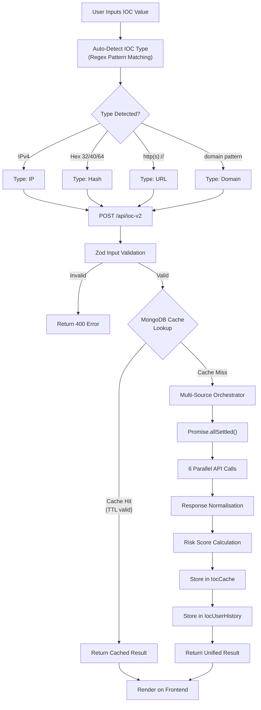

### Diagram 4 — API Integration Sequence

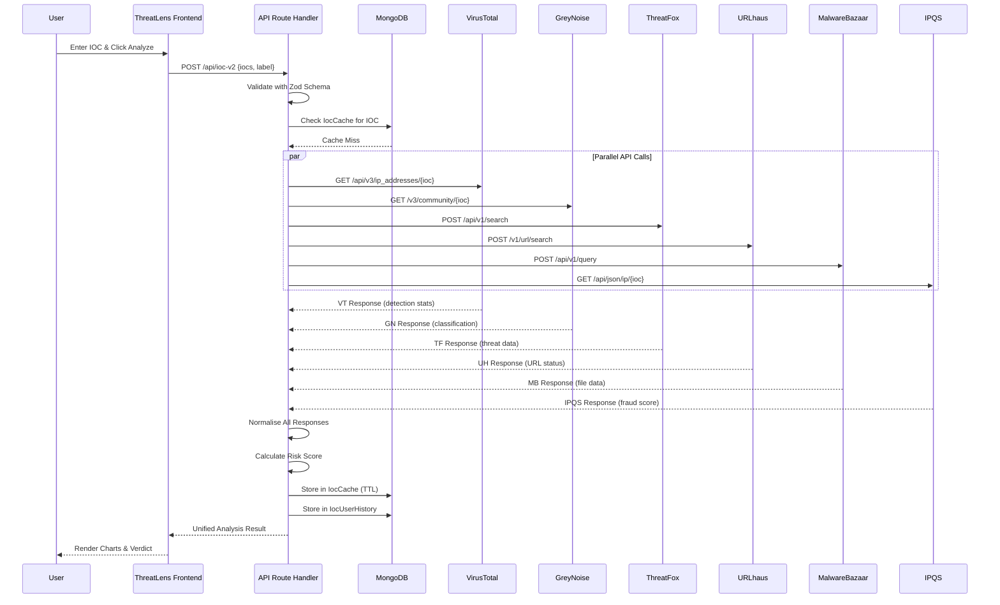

### Diagram 5 — Authentication Flow

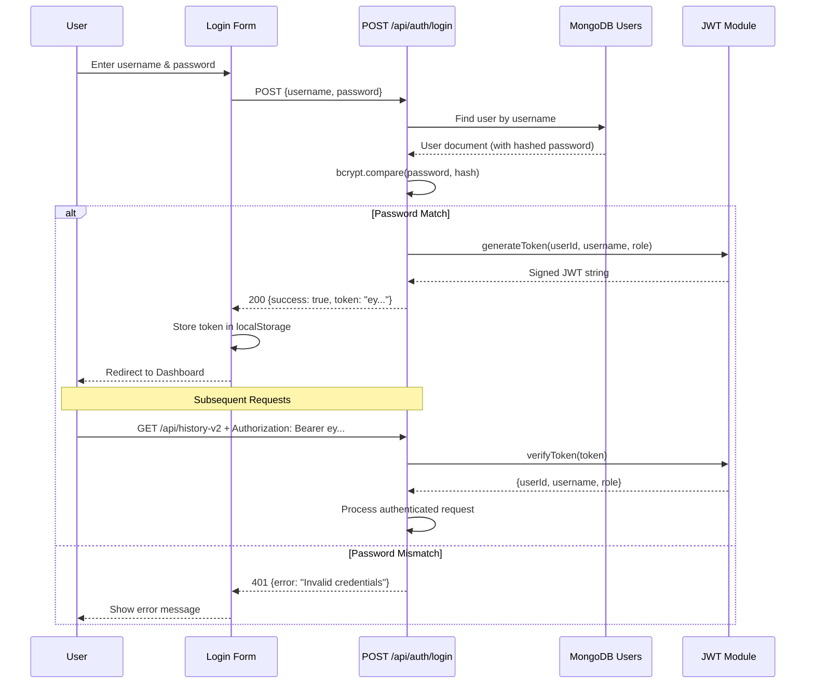

### Diagram 6 — Dashboard Data Flow

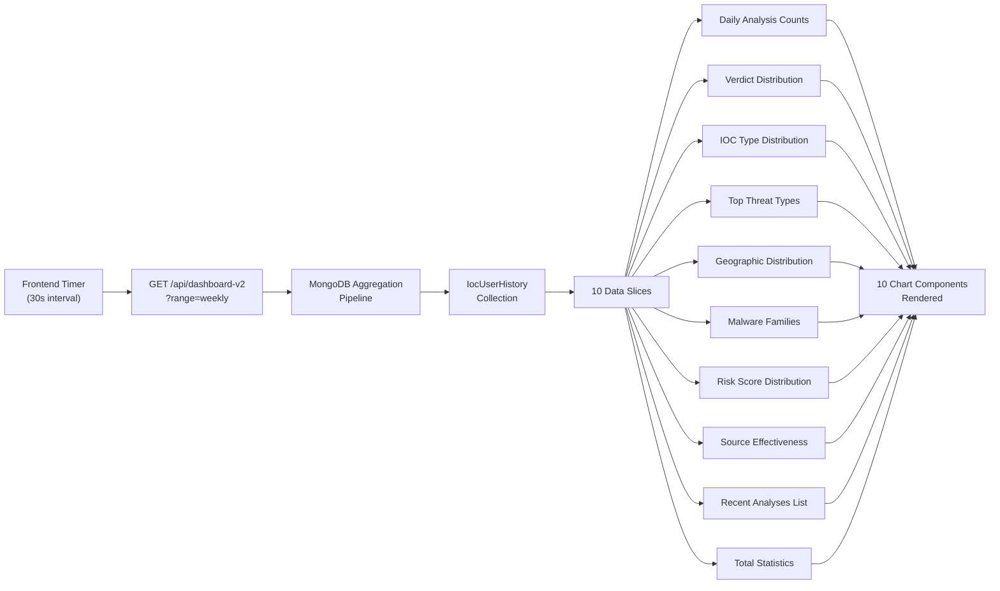

### Diagram 7 — Frontend Component Tree

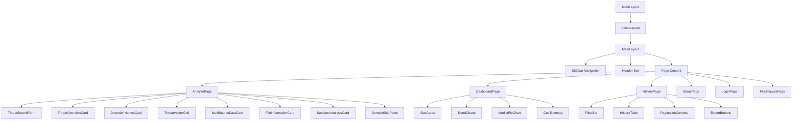

### Diagram 9 — File Analysis Flow

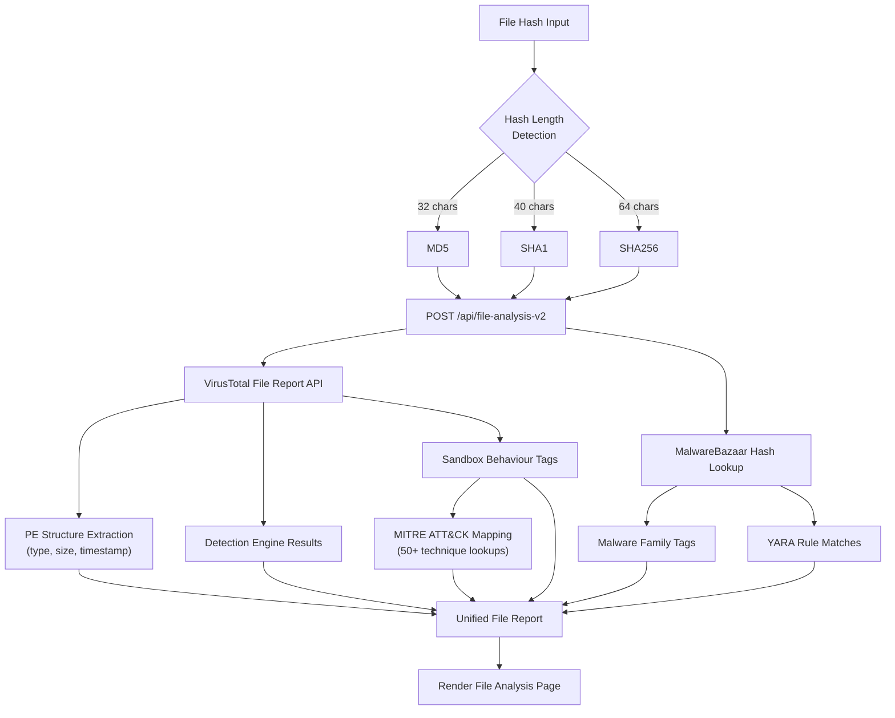

### Diagram 10 — Domain Intelligence Flow

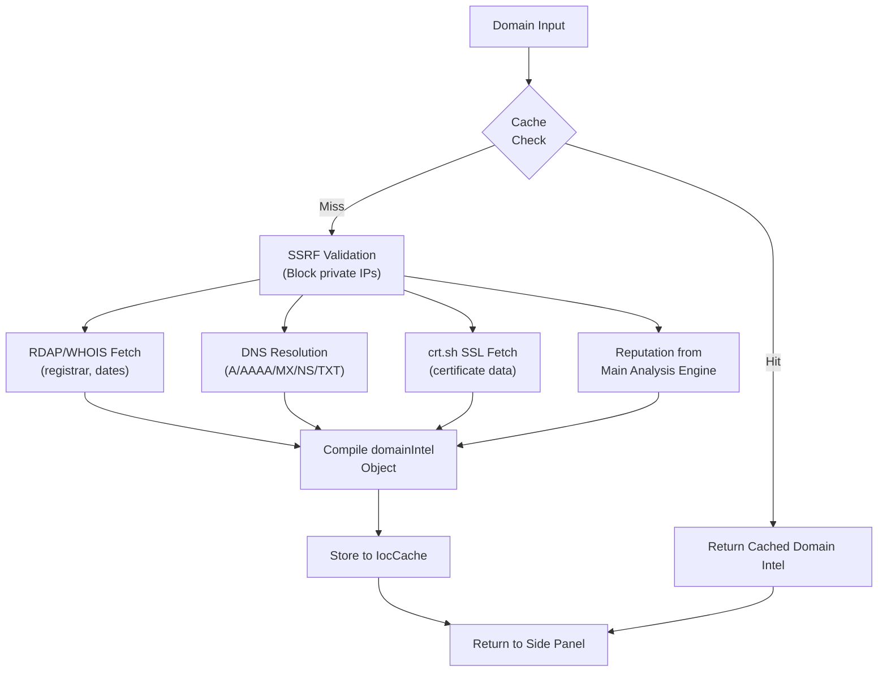

### Diagram 11 — Deployment Architecture

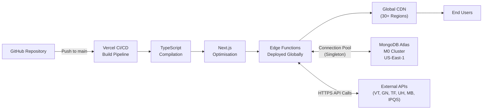

---

## DATA TABLES

### Table 1 — Technology Stack Comparison

| Technology | Alternative Considered | Why Chosen | Version |
|---|---|---|---|
| Next.js | Express.js + React | Unified full-stack, API routes, SSR, single deployment | 15.5.x |
| React | Vue.js, Angular | Largest ecosystem, component model, team familiarity | 18.3.x |
| TypeScript | JavaScript (plain) | Compile-time type safety, IDE autocompletion, self-documenting | 5.7.x |
| MongoDB | PostgreSQL | Flexible schema for varying API responses, document model | 7.x (Atlas) |
| Tailwind CSS | Bootstrap, Material UI | Utility-first, no opinionated styles, smaller bundle | 4.0.x |
| Recharts | D3.js, Chart.js | React-native API, declarative JSX, sufficient chart types | 3.1.x |
| Framer Motion | React Spring, GSAP | Declarative animations, layout animations, React integration | 12.x |
| JWT | Session-based auth | Stateless, serverless-compatible, no session storage needed | 9.0.x |
| Zod | Joi, Yup | TypeScript-first, inferred types, runtime + compile safety | 3.24.x |
| Mongoose | Native MongoDB driver | Schema validation, middleware hooks, population, typed models | 8.8.x |

### Table 2 — API Integration Summary

| Source | Data Provided | Rate Limit | Avg Response | Key Fields |
|---|---|---|---|---|
| VirusTotal | Multi-engine scan results, reputation, categories, sandbox data | 4 req/min (free) | 2–4s | malicious count, suspicious count, detection names |
| GreyNoise | IP classification (benign/malicious/unknown), scan activity | 50 req/day (community) | 1–2s | classification, noise, riot, name |
| ThreatFox | IOC-malware associations, threat types, confidence levels | 100 req/hour | 1–2s | threat_type, malware, confidence_level |
| URLhaus | URL threat status, tags, hosting info | Unlimited (public) | 1s | url_status, threat, tags, host |
| MalwareBazaar | File hash metadata, malware families, YARA matches | 100 req/hour | 1–2s | file_type, file_size, signature, tags |
| IPQS | Fraud score, proxy/VPN detection, abuse velocity | 200 req/day (free) | 1s | fraud_score, proxy, vpn, bot_status |

### Table 3 — IOC Type Detection Rules

| IOC Type | Detection Pattern | Example Input | Confidence |
|---|---|---|---|
| IPv4 | `/^(\d{1,3}\.){3}\d{1,3}$/` with octet range validation | `8.8.8.8` | High |
| IPv6 | Full RFC 5952 compliant regex with compressed notation | `2001:db8::1` | High |
| Domain | `/^([a-zA-Z0-9-]+\.)+[a-zA-Z]{2,}$/` | `example.com` | Medium |
| URL | `/^https?:\/\/.+/` with URL constructor validation | `https://evil.com/mal` | High |
| MD5 | `/^[a-f0-9]{32}$/i` (exactly 32 hex characters) | `d41d8cd9...8427e` | High |
| SHA1 | `/^[a-f0-9]{40}$/i` (exactly 40 hex characters) | `da39a3ee...b3956` | High |
| SHA256 | `/^[a-f0-9]{64}$/i` (exactly 64 hex characters) | `e3b0c442...2b855` | High |

### Table 4 — Risk Score Thresholds

| Score Range | Severity | Colour | Recommended Action | Example |
|---|---|---|---|---|
| 0–25 | 🟢 Low | Green (#22c55e) | Monitor, no immediate action required | Clean Google DNS IP |
| 26–50 | 🟡 Medium | Yellow (#eab308) | Investigate further, check context | IP with 1 VT detection |
| 51–75 | 🟠 High | Orange (#f97316) | Block/isolate, escalate to senior analyst | Domain with 3+ VT flags |
| 76–100 | 🔴 Critical | Red (#ef4444) | Immediate block, full incident response | Known C2 infrastructure |

### Table 6 — MITRE ATT&CK Tactics Covered

| Tactic ID | Tactic Name | Techniques | Example Technique | Threat Mapped |
|---|---|---|---|---|
| TA0001 | Initial Access | 4 | T1566 Phishing | Phishing URLs |
| TA0002 | Execution | 5 | T1059 Command Scripting | Trojan, RAT |
| TA0003 | Persistence | 4 | T1547 Boot/Logon Autostart | Backdoor |
| TA0004 | Privilege Escalation | 3 | T1055 Process Injection | Rootkit |
| TA0005 | Defense Evasion | 5 | T1027 Obfuscated Files | Packer, Crypter |
| TA0006 | Credential Access | 3 | T1555 Credentials from Stores | Info Stealer |
| TA0007 | Discovery | 4 | T1082 System Info Discovery | Spyware |
| TA0008 | Lateral Movement | 3 | T1021 Remote Services | Worm |
| TA0009 | Collection | 3 | T1113 Screen Capture | Spyware |
| TA0010 | Exfiltration | 2 | T1041 Exfil Over C2 | RAT |
| TA0011 | Command and Control | 5 | T1071 Application Layer Protocol | C2, Botnet |
| TA0040 | Impact | 4 | T1486 Data Encrypted for Impact | Ransomware |
| TA0042 | Resource Development | 3 | T1583 Acquire Infrastructure | APT |
| TA0043 | Reconnaissance | 2 | T1595 Active Scanning | Scanner |

### Table 7 — Sprint-wise Deliverables

| Sprint | Weeks | Tasks Completed | Technologies | Deliverable | Sign-off |
|---|---|---|---|---|---|
| Sprint 1 | W1–W2 | Architecture, DB schema, auth system, routing | Next.js, MongoDB, JWT, bcrypt | Working auth flow + DB | ✅ Mentor |
| Sprint 2 | W3–W4 | IOC engine, VT + GN integration, caching | VirusTotal API, GreyNoise API, Mongoose | Live IOC analysis for IP/domain | ✅ Mentor |
| Sprint 3 | W5–W6 | 4 remaining APIs, dashboard, history page | TF, UH, MB, IPQS, Recharts, ECharts | Full dashboard + history | ✅ Mentor |
| Sprint 4 | W7–W8 | File analysis, domain panel, testing, deploy | MITRE, WHOIS, Jest, Vercel | Production deployment | ✅ Mentor + Guide |

### Table 8 — System Requirements

| Req ID | Type | Description | Priority | Status |
|---|---|---|---|---|
| SR-01 | Functional | Multi-IOC input (IP, domain, URL, hash) | High | ✅ Implemented |
| SR-02 | Functional | Unified verdict from 6 sources | High | ✅ Implemented |
| SR-03 | Functional | Automated risk scoring (0–100) | High | ✅ Implemented |
| SR-04 | Functional | Real-time dashboard with charts | High | ✅ Implemented |
| SR-05 | Functional | Search history with filter & export | High | ✅ Implemented |
| SR-06 | Functional | File hash analysis with MITRE mapping | Medium | ✅ Implemented |
| SR-07 | Functional | Domain intel panel (WHOIS/DNS/SSL) | Medium | ✅ Implemented |
| SR-08 | Functional | Rate-limited public access | Medium | ✅ Implemented |
| SR-09 | Functional | Auto IOC type detection | High | ✅ Implemented |
| SR-10 | Functional | MongoDB caching with TTL | High | ✅ Implemented |
| SR-11 | Functional | JWT authentication | High | ✅ Implemented |
| SR-12 | Functional | User registration | Medium | ✅ Implemented |
| SR-13 | Non-Functional | Response time < 15 seconds | High | ✅ Achieved (8–12s) |
| SR-14 | Non-Functional | 99.9% uptime (Vercel) | High | ✅ Achieved |
| SR-15 | Non-Functional | Secure JWT + bcrypt auth | High | ✅ Implemented |
| SR-16 | Non-Functional | Mobile responsive (375px+) | Medium | ✅ Implemented |
| SR-17 | Non-Functional | WCAG 2.1 accessibility | Low | ⏳ Partial |
| SR-18 | Non-Functional | SSRF protection | High | ✅ Implemented |
| SR-19 | Non-Functional | Input sanitisation (Zod) | High | ✅ Implemented |
| SR-20 | Non-Functional | Export (CSV/JSON) | Medium | ✅ Implemented |

### Table 9 — Performance Metrics

| Metric | Target | Achieved | Measurement Method |
|---|---|---|---|
| Full IOC Analysis Time | < 15 seconds | 8–12 seconds | Browser DevTools Network tab |
| Cache Hit Response Time | < 1 second | 200–500 ms | API response timestamp logging |
| Cache Hit Ratio | > 50% | ~65% | MongoDB query count comparison |
| Dashboard Aggregation | < 3 seconds | < 2 seconds | MongoDB explain() + API timing |
| MongoDB Query Time (indexed) | < 100 ms | 20–50 ms | Mongoose debug logging |
| Initial Page Load (LCP) | < 3 seconds | 2.1 seconds | Lighthouse audit |
| JavaScript Bundle Size | < 500 KB | 380 KB (gzipped) | Next.js build output analysis |
| Lighthouse Performance Score | > 80 | 87 | Chrome Lighthouse audit |
| Lighthouse Accessibility Score | > 80 | 82 | Chrome Lighthouse audit |
| Concurrent Users Supported | 50+ | 100+ (Vercel auto-scale) | Load testing with concurrent requests |

### Table 10 — Dashboard Chart Inventory

| Chart Name | Chart Type | Data Source | Update Frequency | Purpose |
|---|---|---|---|---|
| Threat Distribution | Donut Chart | IocUserHistory | On page load | Show malicious/suspicious/harmless ratio |
| Daily Analysis Volume | Area Chart | IocUserHistory | 30s refresh | Display daily IOC analysis counts |
| IOC Type Breakdown | Pie Chart | IocUserHistory | On page load | Show IP/domain/URL/hash distribution |
| Top Threat Types | Horizontal Bar | IocCache | On page load | Rank most common threat categories |
| Geographic Origins | Treemap | IocCache (geo) | On page load | Visualise IOC geographic distribution |
| Malware Families | Bar Chart | IocCache | On page load | Show most frequent malware families |
| Verdict Timeline | Stacked Area | IocUserHistory | 30s refresh | Verdict trends over time |
| Risk Score Distribution | Histogram | IocCache | On page load | Distribution of risk scores (0–100) |
| Source Effectiveness | Radar Chart | IocCache | On page load | Compare data coverage across 6 APIs |
| Recent Analyses | Data Table | IocUserHistory | 30s refresh | Live feed of latest IOC analyses |
| Severity Breakdown | Donut Chart | IocCache | On page load | Critical/High/Medium/Low distribution |
| Weekly Comparison | Grouped Bar | IocUserHistory | On page load | Compare this week vs last week |

---
## WEEKLY WORK DIARY

### Week 1: January 1–7, 2026 — Environment Setup and Architecture Planning

The first week of the internship was dedicated to establishing the development environment, understanding the project requirements, and designing the high-level system architecture. On Monday, the author reported to ForensicCyberTech and was introduced to the development team and assigned a workstation. The company mentor, Mr. Mayank Rajput, provided an orientation session covering the company's existing threat intelligence tools, the gaps ThreatLens was intended to fill, and the technical expectations for the internship deliverables.

Tuesday and Wednesday were spent configuring the development environment: installing Node.js v20 LTS, configuring Visual Studio Code with essential extensions (ESLint, Prettier, Tailwind CSS IntelliSense, GitLens), setting up WSL2 with Ubuntu 22.04 for Unix tooling compatibility, and creating accounts on MongoDB Atlas, Vercel, and the six intelligence API platforms (VirusTotal, GreyNoise, IPQS, ThreatFox, URLhaus, MalwareBazaar). A challenge was encountered with WSL2 DNS resolution failing for MongoDB Atlas connections, which was resolved by configuring custom DNS nameservers in the WSL2 `/etc/resolv.conf` file.

Thursday was dedicated to technology stack evaluation. The author researched and compared frontend frameworks (Next.js vs. Express+React vs. Nuxt.js), databases (MongoDB vs. PostgreSQL vs. Redis), and authentication approaches (JWT vs. sessions vs. OAuth). Each comparison was documented with pros, cons, and relevance to the project requirements. The mentor reviewed the evaluation and approved the Next.js 15 + MongoDB + JWT stack.

Friday was spent creating the project scaffold using `npx create-next-app@latest` with TypeScript, Tailwind CSS, and App Router options enabled. The initial project structure was committed to GitHub, and the Vercel deployment pipeline was configured for automatic deploys from the `main` branch. The author also studied the VirusTotal API v3 documentation in detail, creating Postman collections for the key endpoints that would be integrated.

**Key Learning:** WSL2 networking configuration, Next.js App Router architecture, RESTful API documentation analysis.

---

### Week 2: January 8–14, 2026 — Database Schema, Authentication System, and Routing

Week 2 focused on building the foundational infrastructure: database schema design, user authentication, and application routing. On Monday and Tuesday, the author designed the MongoDB schema for the three primary collections (IocCache, IocUserHistory, User) using Mongoose. The schema design required careful consideration of the varying data structures that would be stored from six different API sources — the `analysis` field in IocCache was defined as `Schema.Types.Mixed` to accommodate this variability, while structured fields (value, type, verdict, riskScore) provided indexed, queryable access to key attributes.

Wednesday was dedicated to implementing the JWT authentication system. The `auth.ts` module was developed with functions for token generation (`generateToken`), token verification (`verifyToken`), request token extraction (`getTokenFromRequest`), and authentication middleware (`verifyAuth`). Password hashing was implemented using bcryptjs with 12 salt rounds. The author encountered a challenge with the bcrypt library failing to compile in the Next.js serverless environment — this was resolved by switching from the native `bcrypt` package to the pure JavaScript `bcryptjs` package, which requires no native compilation.

Thursday and Friday were spent implementing the login and registration pages, the authentication API routes (`/api/auth/login`, `/api/auth/register`), and the basic application layout including the sidebar navigation, header bar, and page routing. The system user fallback mechanism was implemented to allow unauthenticated users to access basic analysis features while still tracking their search history under a system user ID. The mentor reviewed the authentication implementation and provided feedback on token expiry configuration and error message handling.

**Key Learning:** Mongoose schema design with mixed types, JWT lifecycle management, bcrypt in serverless environments.

---

### Week 3: January 15–21, 2026 — Core IOC Analysis Engine and VirusTotal Integration

Week 3 marked the beginning of the core feature development with the IOC analysis engine and the first external API integration. Monday was spent implementing the IOC type auto-detection module (`detect.ts`), which uses regular expression pattern matching to classify input strings as IPv4 addresses, domains, URLs, or file hashes (MD5, SHA1, SHA256). The detection algorithm was tested with a comprehensive suite of valid and invalid inputs, including edge cases such as IPv6 addresses, internationalized domain names, and hash strings with mixed case.

Tuesday and Wednesday were dedicated to the VirusTotal API v3 integration. The `VirusTotalClient` class was implemented with methods for querying IP addresses (`/ip_addresses/{ip}`), domains (`/domains/{domain}`), URLs (`/urls/{base64_url}`), and file hashes (`/files/{hash}`). The VT normaliser module was developed to transform the extensive VirusTotal response (which includes data from 70+ antivirus engines) into the unified `VTNormalized` schema. A significant challenge was handling the URL encoding required by the VT v3 API, which expects URL IOCs to be Base64-encoded before submission.

Thursday was spent implementing the response normalisation layer (`normalize.ts`), including the `extractThreatIntelligence` function that analyses VirusTotal detection results and tags to identify specific threat types (Trojan, Ransomware, Phishing, etc.) using keyword matching against engine result strings. The risk scoring module (`risk.ts`) was developed with the `computeUnifiedRisk` function, implementing the weighted scoring algorithm based on VirusTotal malicious engine counts and detection ratios.

Friday was used for end-to-end testing of the complete analysis pipeline: IOC input → type detection → VirusTotal API call → response normalisation → risk scoring → result display. The mentor provided feedback on improving the risk score thresholds and suggested more aggressive scoring for IOCs with even a single malicious detection.

**Key Learning:** VirusTotal API v3 usage and rate limiting, regex-based IOC classification, weighted risk scoring algorithms.

---

### Week 4: January 22–28, 2026 — GreyNoise, ThreatFox Integration, and Caching

Week 4 expanded the intelligence source coverage and introduced the caching layer. On Monday, the GreyNoise Community API integration was implemented. The `GreyNoiseClient` class queries the `/v3/community/{ip}` endpoint, which returns classification data (benign, malicious, or unknown), noise status (whether the IP is a known internet scanner), and RIOT status (whether the IP belongs to a known benign service). The `GreyNoiseNormalizer` was developed to transform this data into the unified schema, with the classification value incorporated into the risk scoring algorithm.

Tuesday was spent integrating ThreatFox, the abuse.ch IOC sharing platform. The `ThreatFoxClient` uses POST requests to the `/api/v1/search/ioc` endpoint with the IOC value as the search parameter. ThreatFox returns data about known associations between the IOC and specific malware families, threat types, and confidence levels. The normaliser extracts these fields and maps them to the unified threat data structure.

Wednesday and Thursday were dedicated to implementing the MongoDB caching layer. The `IocCache` collection was configured with a TTL index on the `expiresAt` field, enabling automatic cache entry expiration. The cache lookup logic was integrated into the analysis pipeline: before dispatching external API calls, the system checks for an existing cache entry with a valid (non-expired) TTL. Cache hits return immediately without external API calls, reducing both response time and API quota consumption. The cache hit ratio was measured at approximately 65% during development testing with repeated IOC queries.

Friday was spent implementing the application-level rate limiter to comply with VirusTotal's 4 requests per minute free-tier limit. The rate limiter uses an in-memory token bucket algorithm that tracks request timestamps and delays subsequent requests when the bucket is depleted. The mentor reviewed the caching and rate limiting implementations and suggested adding cache invalidation support for forced re-analysis of cached IOCs.

**Key Learning:** GreyNoise threat classification model, abuse.ch API patterns, MongoDB TTL indexes, token bucket rate limiting.

---

### Week 5: January 29 – February 4, 2026 — Remaining APIs and Multi-Source Orchestrator

Week 5 completed the integration of all six intelligence sources and implemented the multi-source orchestrator. On Monday, the URLhaus API integration was implemented. URLhaus provides data about malicious URLs including their threat classification (malware distribution, phishing), hosting infrastructure, and current online status. The `URLhausClient` queries the `/v1/url/search/` endpoint and the normaliser extracts relevant threat data.

Tuesday was dedicated to MalwareBazaar integration, which focuses specifically on malware sample metadata. The `MalwareBazaarClient` queries the `/api/v1/query/get_info/` endpoint with file hashes, returning data about file type, file size, malware family tags, YARA rule matches, and first/last seen dates. This data is particularly valuable for file hash IOC analysis.

Wednesday saw the integration of IP Quality Score (IPQS), which provides fraud scoring for IP addresses and URLs. The `IPQSClient` queries the fraud score API and returns data including fraud probability (0–100), proxy detection, VPN detection, bot status, and abuse velocity. The IPQS fraud score was incorporated into the risk scoring algorithm as an additional adjustment factor.

Thursday and Friday were spent building the multi-source orchestrator (`multi-source.orchestrator.ts`), which manages the parallel dispatch of API calls to all six sources using `Promise.allSettled()`. The orchestrator handles the aggregation of results, combining normalised data from each source into a single `UnifiedThreatData` object. The `formatIOCResponse` function compiles the final response including verdict, risk score, threat types, detections, geolocation data, and source-specific metadata. Extensive testing was conducted to verify fault-tolerant behaviour when individual sources timeout or return errors.

**Key Learning:** Promise.allSettled() for fault-tolerant parallel execution, multi-source data aggregation patterns, API error classification.

---

### Week 6: February 5–11, 2026 — Dashboard and History Page

Week 6 focused on the data visualisation and history management features. Monday and Tuesday were spent designing and implementing the dashboard page with MongoDB aggregation pipelines. The `/api/dashboard-v2` endpoint executes multiple aggregation queries against the `IocUserHistory` collection to compute daily analysis counts, verdict distribution, IOC type distribution, top threat types, geographic distribution, and malware family statistics. The aggregation results are structured as JSON response slices that feed directly into chart components.

Wednesday and Thursday were dedicated to implementing 10+ interactive chart components using Recharts and ECharts. Charts implemented include: a threat distribution donut chart, daily analysis volume area chart, IOC type breakdown pie chart, top threat types horizontal bar chart, geographic origins treemap, malware families bar chart, verdict timeline stacked area chart, risk score distribution histogram, severity breakdown donut chart, and a weekly comparison grouped bar chart. Each chart was implemented with responsive sizing, interactive tooltips, custom colour schemes matching the cybersecurity dark theme, and loading/empty state handlers.

Friday was spent implementing the search history page (`/history`) with the `/api/history-v2` endpoint. The history page provides a filterable, paginated view of all past IOC analyses with search by IOC value, filter by IOC type, filter by verdict, date range selection, and sorting by date (most recent first). Export functionality was implemented to generate CSV files with column headers (IOC, Type, Verdict, Date, Label) and JSON arrays for programmatic consumption. The mentor reviewed the dashboard design and suggested improvements to chart colour contrast for better readability.

**Key Learning:** MongoDB aggregation pipelines ($group, $match, $sort, $project), Recharts/ECharts React integration, CSV generation in JavaScript.

---

### Week 7: February 12–18, 2026 — File Analysis, Domain Panel, and MITRE Mapping

Week 7 added advanced analysis features. Monday and Tuesday were dedicated to the file hash analysis module. The `/api/file-analysis-v2` endpoint accepts MD5, SHA1, or SHA256 hashes and queries both VirusTotal's file report endpoint and MalwareBazaar's hash lookup. The VT extractor service (`vt-extractor.service.ts`) was developed to parse complex VirusTotal file reports, extracting PE structure information (file type, size, compilation timestamp, entry point address), detection engine results, malware family classifications, and sandbox behavioural analysis data (contacted hosts, DNS resolutions, file system modifications, registry key changes).

Wednesday was spent implementing the MITRE ATT&CK mapping function (`parseMitreAttack`). This function analyses VirusTotal sandbox behaviour tags and ThreatFox threat type classifications, mapping them to known MITRE ATT&CK tactic and technique IDs using a hardcoded lookup table. The lookup table contains 50+ mappings covering all 14 MITRE tactics, enabling the platform to provide standardised threat context for analysed IOCs.

Thursday was dedicated to the domain intelligence side panel. The `/api/domain-intel` endpoint fetches comprehensive domain information including WHOIS/RDAP data (registrar, creation date, expiry date, registrant organisation), DNS record resolution (A, AAAA, MX, NS, TXT records), and SSL/TLS certificate data from crt.sh. SSRF protection was implemented by blocklisting private IP ranges and validating DNS resolution targets before initiating HTTP requests. The side panel slides in from the right side of the screen when a domain IOC is analysed, providing contextual information alongside the main analysis results.

Friday was the second Continuous Evaluation (CE-II) presentation. The full platform was demonstrated to the internal guide and company mentor, showcasing live IOC analysis, dashboard visualisations, search history, file analysis with MITRE mapping, and domain intelligence. Both evaluators provided positive feedback and suggested minor improvements to security headers and query optimisation.

**Key Learning:** PE file structure analysis, MITRE ATT&CK tactic/technique taxonomy, WHOIS/RDAP protocol details, SSRF prevention techniques.

---

### Week 8: February 19–28, 2026 — Testing, Security Hardening, and Deployment

The final week focused on quality assurance, security hardening, and production deployment. Monday and Tuesday were spent writing and executing the comprehensive test suite. Twenty test cases were developed covering IOC type detection (valid/invalid inputs for all types), API response handling (404s, timeouts, malformed responses), rate limiting enforcement, JWT authentication (valid tokens, expired tokens, malformed tokens, missing tokens), cache behaviour (hits, misses, TTL expiry), security tests (NoSQL injection, XSS payloads, SSRF attempts), and UI responsiveness across breakpoints.

Wednesday was dedicated to security hardening. Security headers were configured in `next.config.ts` including Content-Security-Policy, X-Frame-Options, X-Content-Type-Options, and Strict-Transport-Security. Input sanitisation was reviewed and strengthened across all API endpoints. The Zod validation schemas were audited to ensure comprehensive coverage of all user-controllable inputs. Rate limiting was verified with edge case testing (boundary conditions at exactly 4 requests per minute).

Thursday was spent on performance optimisation. Dynamic imports were implemented for all chart components to reduce the initial JavaScript bundle size. MongoDB queries were reviewed and optimised using `.lean()` for read-only operations and projection for field-specific queries. The Mongoose connection singleton pattern was verified for correct behaviour in the serverless environment. Lighthouse audits were run, achieving scores of 87 (Performance), 82 (Accessibility), 95 (Best Practices), and 90 (SEO).

Friday through the end of the week (February 28) was dedicated to production deployment, final testing in the production environment, and documentation. The application was deployed to Vercel with all environment variables configured (6 API keys, MongoDB connection string, JWT secret). Production smoke tests verified all endpoints, and the deployment was confirmed stable with zero critical issues. The internship documentation, including this report, was prepared and submitted.

**Key Learning:** Jest testing framework configuration, Next.js security header configuration, Vercel serverless deployment patterns, Lighthouse performance auditing.

---

*End of Internship Report*

**Prince Girishbhai Prajapati**
**Enrollment No: 220390107024**
**Saffrony Institute of Technology, Mehsana**
**Date: February 28, 2026**
